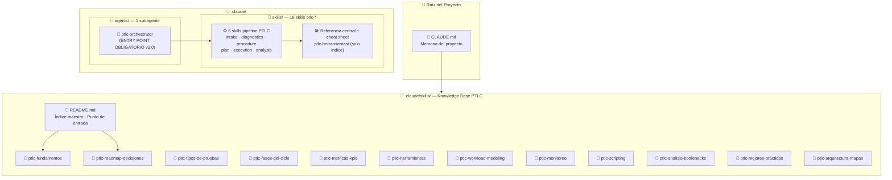
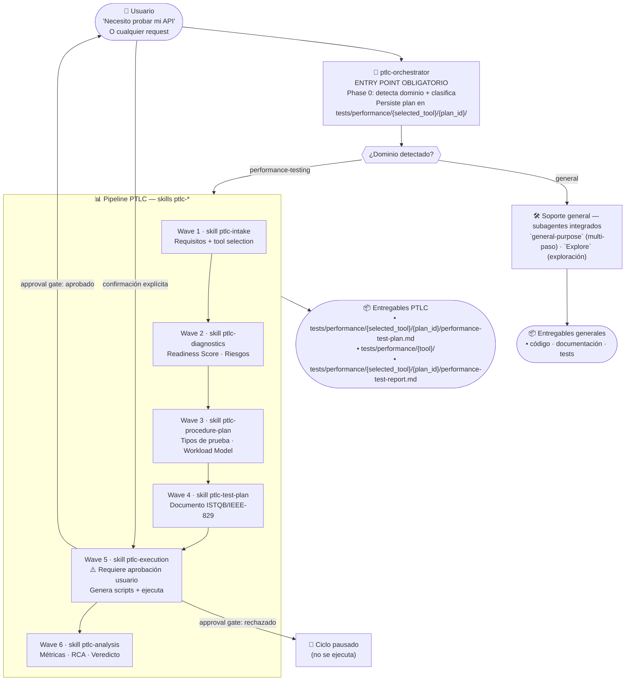
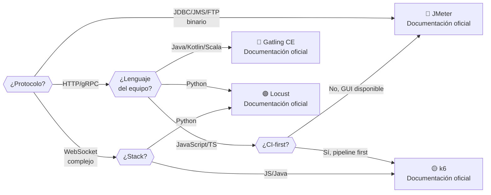
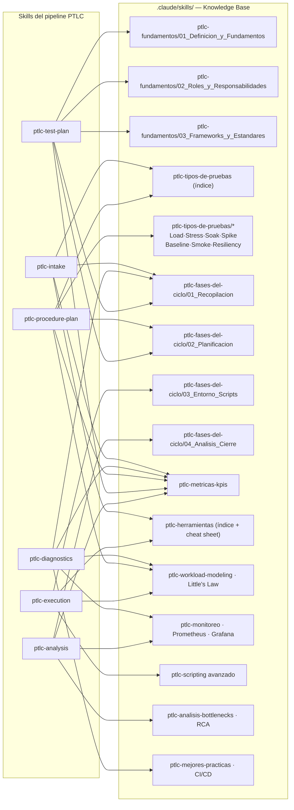
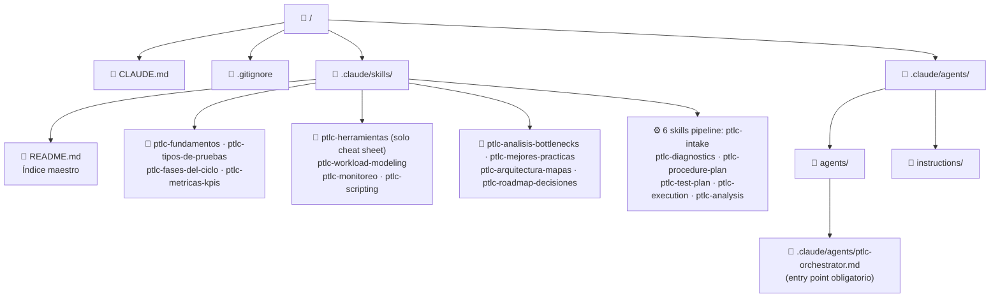
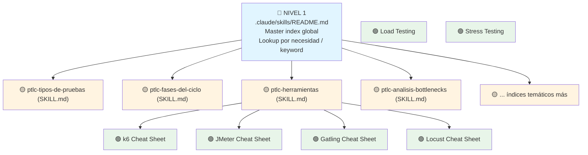

# 🗺️ MAP — Intelligent Performance Test Orchestrator

> Mapa único de la arquitectura v3.0: estructura del repo, pipeline de agentes, cobertura del knowledge base, entregables y tiempos.
> Convenciones y reglas de navegación del repo en [CONVENTIONS.md](CONVENTIONS.md). Pipeline por fases en [`../ptlc-fases-del-ciclo/`](../ptlc-fases-del-ciclo/SKILL.md).

## Índice

1. [Arquitectura general](#1-arquitectura-general)
2. [Pipeline v3.0: ptlc-orchestrator como entry point obligatorio](#2-pipeline-v30-ptlc-orchestrator-como-entry-point-obligatorio)
3. [Fases del pipeline: lecturas, procesos y salidas](#3-fases-del-pipeline-lecturas-procesos-y-salidas)
4. [Guías por agente](#4-guías-por-agente)
5. [Principios de arquitectura y decisiones críticas](#5-principios-de-arquitectura-y-decisiones-críticas)
6. [Selección de herramienta de prueba](#6-selección-de-herramienta-de-prueba)
7. [Cobertura del knowledge base por fase](#7-cobertura-del-knowledge-base-por-fase)
8. [Estructura de archivos](#8-estructura-de-archivos)
9. [Modelo de navegación: 3 niveles](#9-modelo-de-navegación-3-niveles)
10. [Entregables y artefactos por ciclo](#10-entregables-y-artefactos-por-ciclo)
11. [Tiempos estimados por fase](#11-tiempos-estimados-por-fase)

---

## 1. Arquitectura general

---

## 2. Pipeline v3.0: ptlc-orchestrator como entry point obligatorio

---

## 3. Fases del pipeline: lecturas, procesos y salidas

| # | Skill | Entrada | Lecturas del knowledge base | Proceso | Salida / artefacto |
|---|-------|---------|------------------------------|---------|--------------------|
| 0 | `ptlc-orchestrator` | Request del usuario | PRD (`ptlc-roadmap-decisiones`) | Detección de dominio + plan 6-wave | `tests/performance/{selected_tool}/{plan_id}/plan.yaml` |
| 1 | `ptlc-intake` | Solicitud | `ptlc-fundamentos`, `ptlc-tipos-de-pruebas`, `ptlc-herramientas` (cheat sheet), `ptlc-workload-modeling` | Preguntas estructuradas + selección de UNA herramienta | Requisitos completos + herramienta elegida |
| 2 | `ptlc-diagnostics` | Requisitos, entorno | `ptlc-fases-del-ciclo` (readiness), `ptlc-metricas-kpis`, `ptlc-workload-modeling`, `ptlc-monitoreo`, `ptlc-mejores-practicas` | Evaluación de entorno y dependencias | Readiness score + riesgos |
| 3 | `ptlc-procedure-plan` | Requisitos + diagnóstico | `ptlc-tipos-de-pruebas`, `ptlc-workload-modeling` (Little's Law), `ptlc-metricas-kpis` | Tipos de prueba + modelo de carga | Workload model + tipos seleccionados |
| 4 | `ptlc-test-plan` | Procedure plan | `ptlc-fundamentos`, `ptlc-fases-del-ciclo` (planificación) | Redacción ISTQB/IEEE-829 | `tests/performance/{selected_tool}/{plan_id}/performance-test-plan.md` |
| — | **APPROVAL GATE** | Plan completo | — | `ptlc-orchestrator` presenta el plan y espera confirmación explícita | Aprobado → Wave 5 · rechazado → ciclo pausado |
| 5 | `ptlc-execution` | Test plan aprobado | `ptlc-herramientas` (cheat sheet), `ptlc-scripting`, `ptlc-fases-del-ciclo` | Generación on-demand de scripts + ejecución | Scripts + resultados en `tests/performance/{selected_tool}/{plan_id}/` |
| 6 | `ptlc-analysis` | Resultados de ejecución | `ptlc-metricas-kpis`, `ptlc-analisis-bottlenecks`, `ptlc-fases-del-ciclo` (análisis y cierre), `ptlc-monitoreo` | Métricas + RCA + health scoring | `tests/performance/{selected_tool}/{plan_id}/performance-test-report.md` + veredicto PASSED/FAILED |

---

## 4. Guías por agente

| Agente | Guías que debe leer |
|--------|--------------------|
| `ptlc-orchestrator` | Detección de dominio (Phase 0), generación de plan 6-wave (Phase 2), approval gate (Phase 3B) |
| `ptlc-intake` | [`ptlc-herramientas/SKILL.md`](../ptlc-herramientas/SKILL.md) — matriz de decisión rápida vía cheat sheet |
| `ptlc-diagnostics` | Checklist de readiness de [`ptlc-fases-del-ciclo/SKILL.md`](../ptlc-fases-del-ciclo/SKILL.md) |
| `ptlc-procedure-plan` | [`ptlc-tipos-de-pruebas/SKILL.md`](../ptlc-tipos-de-pruebas/SKILL.md) + [`ptlc-workload-modeling/SKILL.md`](../ptlc-workload-modeling/SKILL.md) — tipos de prueba + Little's Law |
| `ptlc-test-plan` | [`ptlc-fundamentos/SKILL.md`](../ptlc-fundamentos/SKILL.md) + template ISTQB/IEEE-829 de [`ptlc-fases-del-ciclo/`](../ptlc-fases-del-ciclo/SKILL.md) |
| `ptlc-execution` | Cheat sheet en [`ptlc-herramientas/00b_Cheat_Sheet_Herramientas.md`](../ptlc-herramientas/00b_Cheat_Sheet_Herramientas.md) + [`ptlc-scripting/`](../ptlc-scripting/SKILL.md) |
| `ptlc-analysis` | [`ptlc-metricas-kpis/SKILL.md`](../ptlc-metricas-kpis/SKILL.md) — percentiles, Apdex, throughput, error rate · [`ptlc-analisis-bottlenecks/SKILL.md`](../ptlc-analisis-bottlenecks/SKILL.md) — 5 Whys, Fishbone, health scoring, ranking P1/P2/P3 |

---

## 5. Principios de arquitectura y decisiones críticas

| Principio | Implementación |
|-----------|----------------|
| Entry point único | `ptlc-orchestrator` recibe todos los requests; resuelve los no-PTLC con los subagentes integrados (`general-purpose`/`Explore`) o el knowledge base |
| Una herramienta por ciclo | `ptlc-intake` selecciona UNA herramienta; nunca paralelo |
| Generación on-demand | Scripts generados en Wave 5 — no existen pre-creados |
| Aprobación explícita | `ptlc-execution` no corre sin confirmación del usuario |
| Resultados individuales | Cada ejecución es independiente; no hay comparación cross-tool |
| Estado persistido | `tests/performance/{selected_tool}/{plan_id}/plan.yaml` guarda el estado de cada ciclo |
| Knowledge Base como fuente de verdad | Cada agente lee los documentos relevantes antes de actuar |
| Outputs en español | Todos los reportes, planes y comunicaciones en español |

| Decisión | Valor | Justificación |
|----------|-------|---------------|
| Script generation | On-demand en Wave 5 | No existen scripts pre-creados; se generan para cada request |
| Output path | `tests/performance/{selected_tool}/{plan_id}/` | Organización por herramienta y ciclo para trazabilidad |
| State persistence | `tests/performance/{selected_tool}/{plan_id}/plan.yaml` | Permite retomar ciclos interrumpidos |
| Approval gate | Requerida antes de ejecutar | `ptlc-execution` tiene impacto real sobre infraestructura |
| Idioma | Español en todos los outputs | Requisito de producto definido en [`ptlc-roadmap-decisiones/PRD.yaml`](../ptlc-roadmap-decisiones/PRD.yaml) |

---

## 6. Selección de herramienta de prueba

> **Nota v3.0:** La skill `ptlc-herramientas` ahora solo contiene el cheat sheet central ([`00b_Cheat_Sheet_Herramientas.md`](../ptlc-herramientas/00b_Cheat_Sheet_Herramientas.md)). Toda información detallada sobre k6, JMeter, Gatling y Locust está en la documentación oficial de cada herramienta. Usa el cheat sheet para decisión rápida y navegación a secciones comunes (CI/CD, troubleshooting).

---

## 7. Cobertura del knowledge base por fase

---

## 8. Estructura de archivos

---

## 9. Modelo de navegación: 3 niveles

---

## 10. Entregables y artefactos por ciclo

| Fase | Entregable principal | Formato | Ubicación |
|------|---------------------|---------|-----------|
| F1 (Intake) | `requirements.json` + herramienta seleccionada | JSON | `tests/performance/{selected_tool}/{plan_id}/` |
| F2 (Diagnostics) | Readiness score + riesgos identificados | JSON | `tests/performance/{selected_tool}/{plan_id}/` |
| F3 (Procedure Plan) | Workload model + tipos de prueba | YAML | `tests/performance/{selected_tool}/{plan_id}/` |
| F4 (Test Plan) | Documento formal ISTQB/IEEE-829 | Markdown | `tests/performance/{selected_tool}/{plan_id}/performance-test-plan.md` |
| **Gate** | Aprobación explícita del usuario | Confirmación | Interfaz UI |
| F5 (Execution) | Scripts generados + resultados | Scripts + JSON | `tests/performance/{selected_tool}/{plan_id}/` |
| F6 (Analysis) | Reporte final con veredicto | Markdown | `tests/performance/{selected_tool}/{plan_id}/performance-test-report.md` |

---

## 11. Tiempos estimados por fase

| Fase | Tiempo estimado | Depende de |
|------|-----------------|------------|
| F0 (Detection) | ~2 min | Complejidad del request |
| F1 (Intake) | 5-15 min | Cantidad de preguntas |
| F2 (Diagnostics) | 3-8 min | Complejidad del entorno |
| F3 (Procedure Plan) | 5-10 min | Workload model complexity |
| F4 (Test Plan) | 8-15 min | Longitud del documento formal |
| **Gate** | Variable | Respuesta usuario |
| F5 (Execution) | 10-30 min | Scripts generados + infraestructura |
| F6 (Analysis) | 5-12 min | Cantidad de métricas/RCA |

**Total ciclo completo:** ~45-90 minutos promedio

---

*Documento generado automáticamente por análisis del repositorio PTLC MAP*  
*Última actualización: 2026-10-05*
