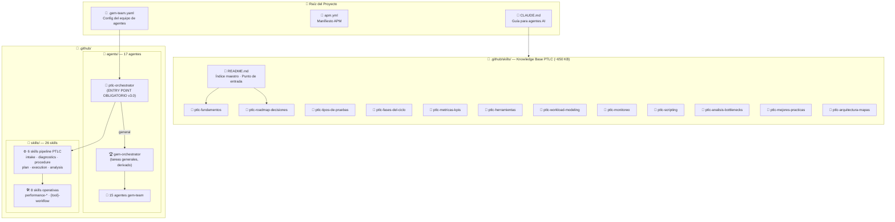
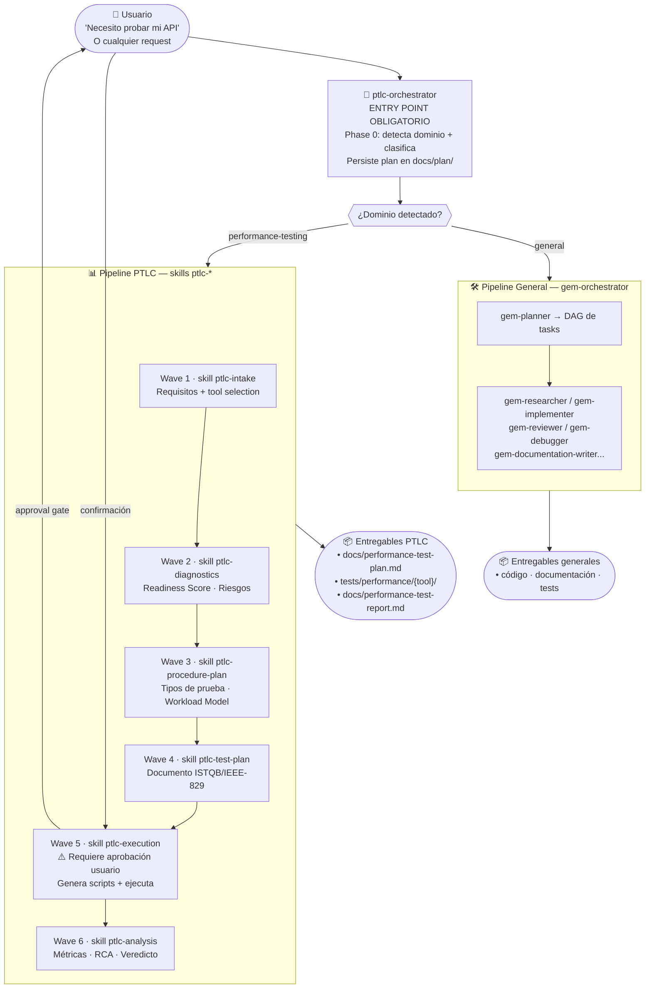
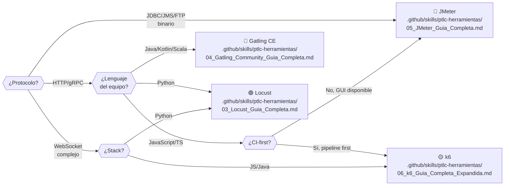
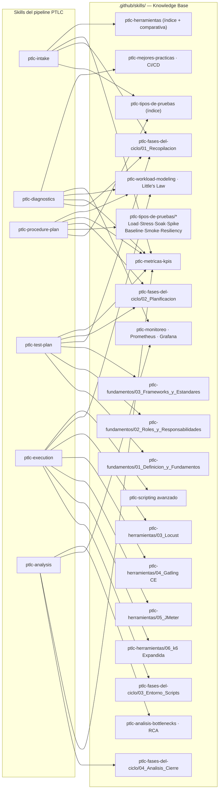
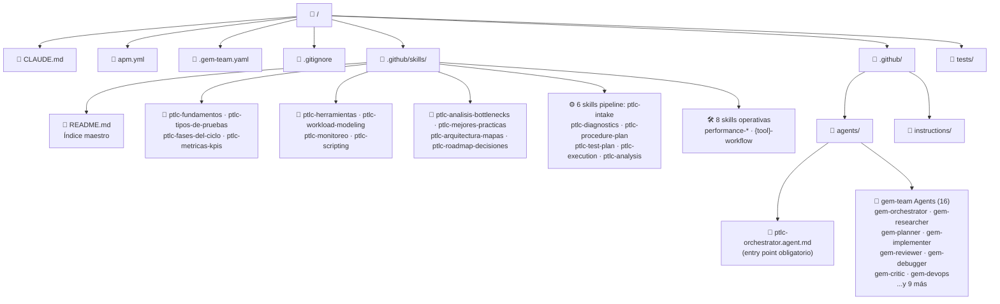
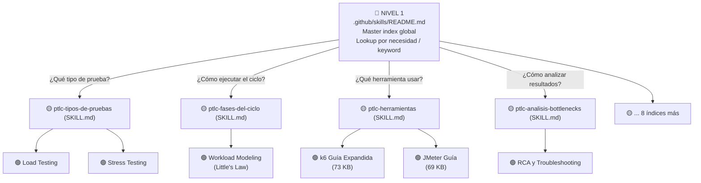
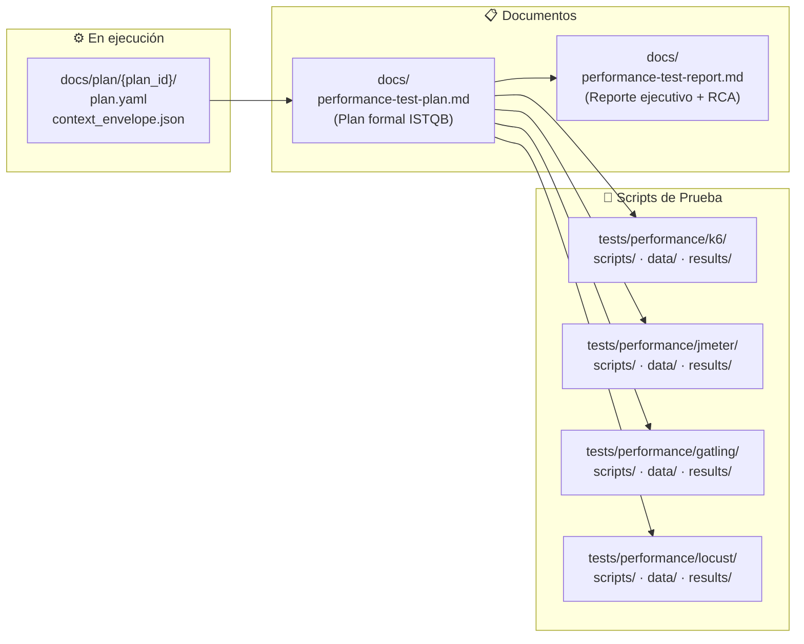

# 🗺️ MAP — Intelligent Performance Test Orchestrator

> Mapa visual completo del proyecto: estructura, agentes, flujos y cobertura de conocimiento.

---

## 1. Arquitectura General del Proyecto

---

## 2. Flujo v3.0 — ptlc-orchestrator como entry point obligatorio

---

## 3. Selección de Herramienta de Prueba

---

## 4. Cobertura de Knowledge Base por Fase (skills)

---

## 5. Estructura de Archivos Completa

---

## 6. Modelo de Navegación (3 Niveles)

---

## 7. Entregables Generados por el Proceso PTLC

---

*Actualizado: Octubre 2026 — v3.0: knowledge base migrada de `DOCs/` a `.github/skills/`, `ptlc-orchestrator` como entry point obligatorio*
