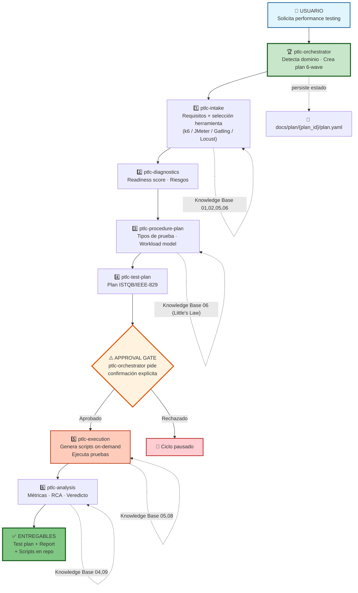
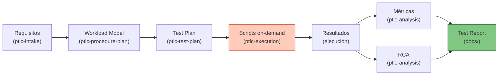

# Mapa Funcional Simplificado — Vista Ejecutiva v3.0

## 🎯 Flujo Simplificado (ptlc-orchestrator + Pipeline PTLC por skills)



---

## 📊 Tabla Resumen: Entrada → Proceso → Salida

| Fase | Agente | Entrada | Proceso | Salida |
|------|--------|---------|---------|--------|
| 0 | ptlc-orchestrator | Request usuario | Detección de dominio + plan 6-wave | Plan en `docs/plan/{plan_id}/plan.yaml` |
| 1 | ptlc-intake | Solicitud + Knowledge Base 01/02/05/06 | Preguntas estructuradas + selección herramienta | Requisitos completos, herramienta elegida |
| 2 | ptlc-diagnostics | Requisitos, entorno | Evaluación readiness | Readiness score + riesgos |
| 3 | ptlc-procedure-plan | Requisitos + diagnóstico + Knowledge Base 06 | Little's Law + tipos de prueba | Workload model + tipos seleccionados |
| 4 | ptlc-test-plan | Procedure plan + Knowledge Base 03 | Redacción ISTQB/IEEE-829 | `docs/performance-test-plan.md` |
| — | **APPROVAL GATE** | Plan completo | ptlc-orchestrator presenta y espera confirmación | Aprobación o pausa |
| 5 | ptlc-execution | Test plan + Knowledge Base 05/08 | Generación on-demand + ejecución | Scripts en `tests/performance/{tool}/{plan_id}/` + resultados |
| 6 | ptlc-analysis | Resultados + Knowledge Base 04/09 | Métricas + RCA + health scoring | `docs/performance-test-report.md` + veredicto |

---

## 🔄 Decisiones Críticas en el Flujo

| Punto | Decisión | Justificación |
|-------|----------|---------------|
| Tool Selection | ptlc-intake selecciona UNA herramienta | Cada ciclo PTLC es individual; no hay ejecución paralela multi-tool |
| Script Generation | On-demand en Wave 5 | No existen scripts pre-creados; se generan para cada request |
| Approval Gate | Requerida antes de ejecución | ptlc-execution tiene impacto real sobre infraestructura |
| Output path | `tests/performance/{tool}/{plan_id}/` | Organización por herramienta y ciclo para trazabilidad |
| State persistence | `docs/plan/{plan_id}/plan.yaml` | Permite retomar ciclos interrumpidos |
| Idioma | Español en todos los outputs | Requisito de producto definido en `.github/skills/ptlc-roadmap-decisiones/PRD.yaml` |

---

## 📚 Knowledge Base Consultados por Fase

| Fase | Knowledge Base consultados | Propósito |
|------|-----------------|-----------|
| ptlc-intake | 01 Fundamentos, 02 Tipos de prueba, 05 Herramientas, 06 Workload | Contexto + selección herramienta |
| ptlc-diagnostics | 03 Fases PTLC | Checklist de readiness |
| ptlc-procedure-plan | 06 Workload Modeling (Little's Law) | Cálculo de VUs y modelo de carga |
| ptlc-test-plan | 03 Fases PTLC (Planificación) | Template ISTQB/IEEE-829 |
| ptlc-execution | 05 Guía herramienta seleccionada, 08 Scripting avanzado | Generación de scripts correctos |
| ptlc-analysis | 04 Métricas exhaustivas, 09 RCA y troubleshooting | Percentiles, Apdex, 5 Whys, health score |

---

## 🛠️ Artefactos Generados por Ciclo

### Documentos (en `docs/`)
```
docs/
├── performance-test-plan.md        ← Wave 4 (ptlc-test-plan)
├── performance-test-report.md      ← Wave 6 (ptlc-analysis)
└── plan/{plan_id}/
    └── plan.yaml                   ← Estado del ciclo (ptlc-orchestrator)
```

### Scripts (en `tests/`, generados on-demand en Wave 5)
```
tests/performance/{tool}/{plan_id}/
├── [para k6]       script.js + run.sh
├── [para JMeter]   test-plan.jmx + pom.xml + run.ps1
├── [para Gatling]  Simulation.scala/Java/Kotlin + pom.xml
└── [para Locust]   locustfile.py + run.sh
```

---

## 🔗 Flujo de Datos



---

## 📈 Tiempo estimado por fase

```
ptlc-orchestrator (Phase 0+2)   ██░░░░░░░░░░  ~2 min  (detección + plan)
ptlc-intake     (Wave 1)       ████░░░░░░░░  ~5 min  (preguntas + selección)
ptlc-diagnostics (Wave 2)      ████░░░░░░░░  ~5 min  (readiness check)
ptlc-procedure-plan (Wave 3)   ████████░░░░  ~10 min (workload modeling)
ptlc-test-plan  (Wave 4)       ██████████░░  ~15 min (redacción del plan)
APPROVAL GATE                  ██░░░░░░░░░░  variable
ptlc-execution  (Wave 5)       ████████████  variable (gen + ejecución)
ptlc-analysis   (Wave 6)       ████████░░░░  ~10 min (análisis + reporte)
──────────────────────────────────────────
TOTAL (sin ejecución)                         ~47 min
```

---

## ✅ Principios de Diseño

| Principio | Descripción |
|-----------|-------------|
| Una herramienta por ciclo | `ptlc-intake` elige UNA; nunca paralelo |
| Generación on-demand | Scripts creados al momento de ejecutar, no antes |
| Aprobación obligatoria | La ejecución real requiere confirmación explícita |
| Sin resultados cruzados | Los reportes son individuales a la herramienta elegida |
| Estado persistido | `docs/plan/{plan_id}/plan.yaml` guarda el ciclo completo |
| Knowledge Base como fuente de verdad | Cada agente lee Knowledge Base antes de actuar |
| Outputs en español | Todos los reportes y comunicaciones en español |

---

*Arquitectura v3.0 — ptlc-orchestrator como entry point obligatorio — actualizado Octubre 2026*
