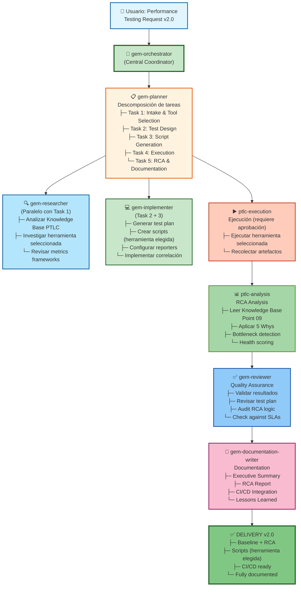

# Framework v2.0 - Mejoras Arquitectónicas Propuestas

## 📌 Recomendación: Gem-Team como Orquestador

### Contexto
La v1.0 del baseline + RCA fue ejecutada por **CLI directo**, lo cual fue eficiente pero **no escalable** para versiones futuras que requieran mayor rigor y paralelismo.

---

## 🎯 v2.0: Migración a Gem-Orchestrator

### ¿Por qué Gem-Team en v2.0?

```
v1.0 (Current)                    v2.0 (Proposed)
─────────────────────────────────────────────────────
├─ CLI: Orquestador único         ├─ gem-orchestrator: Central
├─ Lineal: Intake → ... → Output  ├─ DAG wave-based execution
├─ Single review (yo)             ├─ Multi-stage gates (reviewer por wave)
├─ Scope: 1 endpoint              ├─ Scope: Múltiples endpoints
├─ Focus: Load baseline           ├─ Focus: Load + Stress + Spike
├─ Herramientas: Gatling only     ├─ Herramientas: k6, JMeter, Gatling, Locust
└─ Métricas: p1-p99.9            └─ Métricas: p1-p99.9 + bottleneck ranking
```

---

## 🏗️ Arquitectura Propuesta v2.0



---

## 📋 Tareas Propuestas para v2.0

### Phase 1: Planning (gem-planner)
```
[ ] Descomponer requerimientos en tasks
    ├─ Intake: Requisitos + selección de herramienta
    ├─ Design: Test plan para la herramienta elegida
    ├─ Execution: Generación de scripts + ejecución
    ├─ Analysis: RCA + reporte final
    └─ Documentation: Entregables del ciclo

[ ] Definir dependencias
    ├─ Task 2 depends on Task 1 (tool selection first)
    ├─ Task 3 depends on Task 2
    ├─ Task 4 depends on Task 3
    └─ Task 5 depends on Task 4

[ ] Asignar agentes
    ├─ ptlc-intake → Task 1
    ├─ ptlc-procedure-plan + ptlc-test-plan → Task 2
    ├─ ptlc-execution → Task 3
    ├─ ptlc-analysis → Task 4
    └─ gem-documentation-writer → Task 5
```

### Phase 2: Research (gem-researcher, paralelo con intake)
```
[ ] Investigar herramienta seleccionada en profundidad
    ├─ Leer .github/skills/ptlc-herramientas/{herramienta}
    ├─ Mejores prácticas para el tipo de prueba elegido
    └─ Integración con CI/CD para esa herramienta

[ ] Buscar patrones PTLC avanzados
    ├─ RCA frameworks (Knowledge Base 09)
    ├─ Bottleneck detection avanzado
    └─ SLA definition best practices

[ ] Revisar Knowledge Base updates
    ├─ New metrics? (Knowledge Base 04)
    ├─ New RCA patterns? (Knowledge Base 09)
    └─ New CI/CD patterns? (Knowledge Base 10)
```

### Phase 3: Implementation (gem-implementer)
```
[ ] Generar test plan para la herramienta seleccionada
    ├─ Template parametrizado
    └─ Configuración específica del entorno

[ ] Crear scripts de ejecución
    ├─ run_{herramienta}_baseline.{ext}
    └─ Parámetros de carga configurables

[ ] Implementar RCA v2.0 (por herramienta)
    ├─ Advanced bottleneck detection
    └─ Automatic report generation
```

### Phase 4: Execution (ptlc-execution — requiere aprobación usuario)
```
[ ] Ejecutar herramienta seleccionada
    └─ Recolectar artefactos nativos de esa herramienta

[ ] Generar artefactos
    ├─ JTL + HTML (si JMeter)
    ├─ JSON summary (si k6)
    ├─ HTML report (si Gatling)
    └─ CSV results (si Locust)
```

### Phase 5: Review (gem-reviewer)
```
[ ] Validar resultados
    ├─ ¿SLAs cumplidas?
    └─ ¿RCA logic sound?

[ ] Audit de calidad
    ├─ Test plan review
    ├─ Scripts quality check
    ├─ RCA framework validation
    └─ Documentation completeness

[ ] Sign-off
    ├─ Approve baseline v2.0
    ├─ Mark as production-ready
    └─ Create release notes
```

### Phase 6: Documentation (gem-documentation-writer)
```
[ ] README v2.0
    ├─ Guía por herramienta
    └─ Advanced features

[ ] Executive Summary por ejecución
    ├─ Baseline results de la herramienta usada
    └─ SLA assessment

[ ] RCA Framework v2.0
    ├─ Advanced bottleneck patterns
    └─ Automatic recommendations engine

[ ] CI/CD Integration v2.0
    ├─ Automated tool selection
    ├─ Historical tracking (por herramienta)
    ├─ Regression detection
    └─ Slack notifications

[ ] Lessons Learned Doc
    ├─ v1.0 to v2.0 improvements
    ├─ Tool selection criteria
    ├─ RCA best practices
    └─ Future enhancements roadmap
```

---

## 🔄 Mejoras Específicas por Agente

### gem-planner Improvements
```
v1.0: Manual planning (yo mismo)
v2.0: 
  ├─ DAG-based task decomposition
  ├─ Dependency visualization
  ├─ Critical path analysis
  ├─ Resource allocation
  └─ Risk assessment per task
```

### gem-researcher Improvements
```
v1.0: Implicit research (while implementing)
v2.0:
  ├─ Explicit Knowledge Base investigation por herramienta seleccionada
  ├─ Metric framework analysis
  ├─ SLA best practices research
  └─ Benchmark data gathering
```

### gem-implementer Improvements
```
v1.0: Single implementation (Gatling only)
v2.0:
  ├─ Templates para cada herramienta (k6, JMeter, Locust, Gatling)
  ├─ Cada herramienta se implementa individualmente cuando es seleccionada
  ├─ Advanced RCA logic por herramienta
  └─ Automatic recommendations engine
```

### gem-reviewer Improvements
```
v1.0: Manual review (final check only)
v2.0:
  ├─ Continuous review gates
  ├─ Multi-stage validation
  ├─ Test plan audit
  ├─ Results consistency check
  ├─ SLA compliance audit
  └─ Automated quality gates
```

### gem-documentation-writer Improvements
```
v1.0: Manual markdown generation (yo mismo)
v2.0:
  ├─ Automatic documentation from analysis results
  ├─ Executive summary por ejecución
  ├─ RCA report por herramienta
  ├─ API documentation auto-generation
  └─ Release notes auto-generation
```

---

## 📊 v1.0 vs v2.0 Comparison

```
ASPECTO                    | v1.0              | v2.0
───────────────────────────|───────────────────|──────────────────
Orquestador                | CLI directo       | gem-orchestrator
Flujo de ejecución         | Lineal            | DAG wave-based
Herramientas soportadas    | Gatling           | k6, JMeter, Gatling, Locust
Modelo de uso              | Una herramienta   | Una herramienta elegida por proyecto
Resultados                 | Por herramienta   | Por herramienta (individual)
RCA Frameworks             | 5-step basic      | Advanced + bottleneck ranking
Review stages              | 1 (final)         | Multi-stage gates
Documentation              | Manual            | Semi-automated
Trend analysis             | N/A               | Por herramienta (historial propio)
Agentes involucrados       | 1 (CLI)           | 6+ (gem-team + ptlc-*)
Velocidad ejecución        | Más rápido        | Más lento (mayor rigor)
Rigor/Quality              | Bueno             | Excelente
Escalabilidad              | Limitada          | Alta
CI/CD maturity             | v0.1              | v1.0+
```

---

## 🚀 Implementación Propuesta

### Fase 1: v1.1 (Quick Win)
```
Mantener architecture v1.0
+ Agregar templates k6 y Locust
+ Mejorar RCA (bottleneck ranking)
Timeline: 1-2 semanas
```

### Fase 2: v2.0 (Major Refactor)
```
Migrar a gem-orchestrator como entry point unificado
Implementar templates para k6, JMeter, Locust
Advanced RCA por herramienta
Full CI/CD integration
Timeline: 4-6 semanas
```

### Fase 3: v2.1 (Polish)
```
Agregar Prometheus integration
Grafana dashboard templates
Trend analysis por herramienta (historial propio)
Automated recommendations engine
Timeline: 2-3 semanas
```

---

## 📌 Decisiones Clave para v2.0

### 1. Tool Support Priority
```
TIER 1 (Crítico):
├─ JMeter (v1.0 base)
└─ k6 (moderno, CI/CD friendly)

TIER 2 (Importante):
├─ Locust (Python-based)
└─ Gatling (Scala/Java)

TIER 3 (Future):
├─ Apache Bench
└─ Wrk2
```

### 2. RCA Framework v2.0
```
Mantener:
├─ 5 Whys methodology
├─ Fishbone analysis
└─ Health scoring

Agregar:
├─ Bottleneck correlation avanzada
├─ Root cause ranking (priorización P1/P2/P3)
├─ Trend analysis por herramienta (ejecución actual vs historial de esa herramienta)
└─ Automatic recommendations engine
```

### 3. Automation Level
```
v1.0: Manual execution, semi-auto reporting
v2.0: Auto tool selection → Auto execution → Auto analysis → Auto reporting
```

---

## ✅ Criterios de Éxito v2.0

```
CRITERIO                                    | v1.0 | v2.0
─────────────────────────────────────────|────|──────
Soporta k6, JMeter, Gatling, Locust      | ❌  | ✅
Selección de herramienta asistida        | ❌  | ✅
Review automático integrado              | ❌  | ✅
RCA avanzada (bottleneck ranking)        | ❌  | ✅
Trend analysis por herramienta           | ❌  | ✅
CI/CD fully integrated                   | 🟡  | ✅
Documentación auto-generada              | ❌  | ✅
Gem-team orchestration (gem-orchestrator)| ❌  | ✅
Escalable a 10+ endpoints                | ❌  | ✅
Production-grade quality                 | 🟡  | ✅
```

---

## 🎓 Conclusión

**v1.0 (actual)**: ✅ Excelente MVP, pero lineal y con una sola herramienta (Gatling)
**v2.0 (propuesta)**: 🚀 Enterprise-grade con gem-orchestrator, soporte para k6/JMeter/Gatling/Locust y RCA avanzada

La migración a **gem-orchestrator en v2.0** permitirá:
- ✅ DAG wave-based execution
- ✅ Soporte para 4 herramientas (elegidas individualmente por proyecto)
- ✅ Review quality gates
- ✅ Advanced RCA con bottleneck ranking
- ✅ Automated reports
- ✅ Escalabilidad

**Recomendación**: Comenzar v2.0 cuando v1.0 sea completamente adoptado y se identifiquen los primary pain points.
