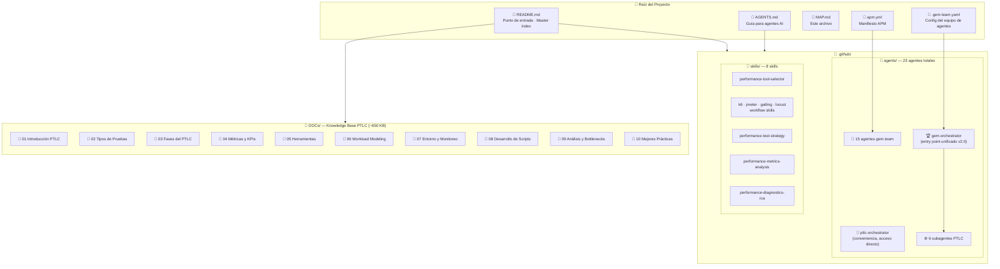
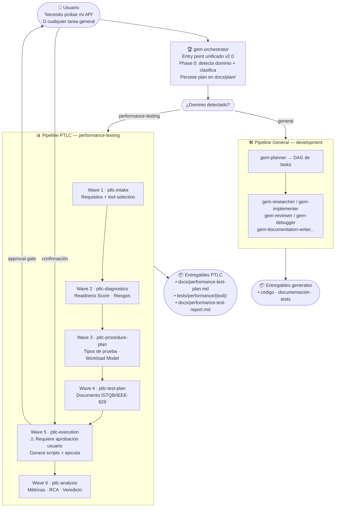
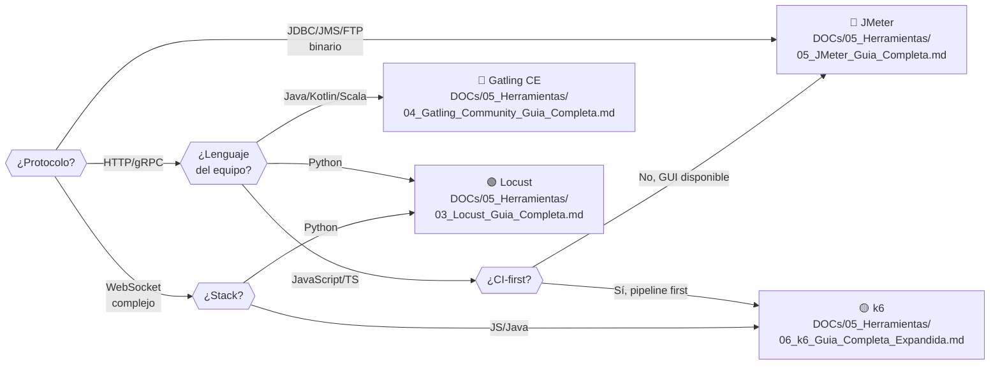
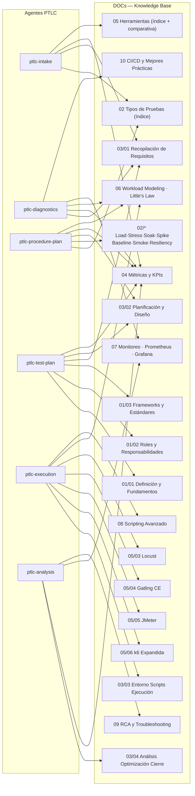
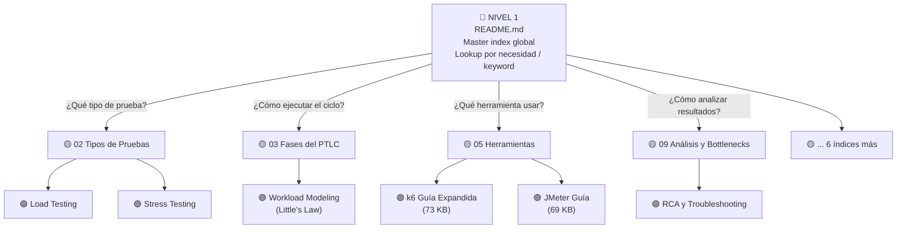
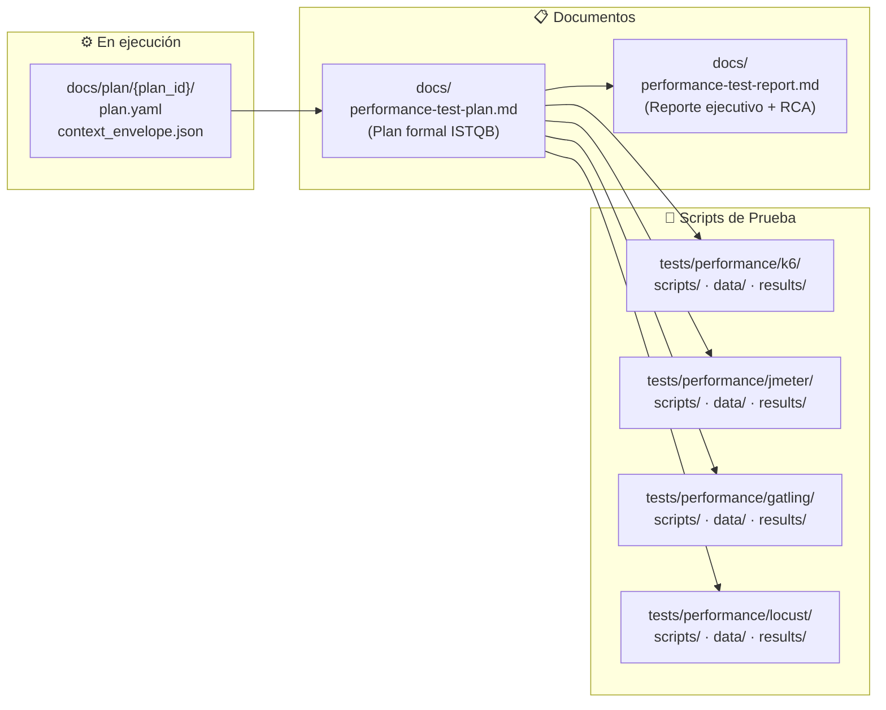

# 🗺️ MAP — Intelligent Performance Test Orchestrator

> Mapa visual completo del proyecto: estructura, agentes, flujos y cobertura de conocimiento.

---

## 1. Arquitectura General del Proyecto

---

## 2. Flujo v2.0 — gem-orchestrator como coordinador central

---

## 3. Selección de Herramienta de Prueba

---

## 4. Cobertura de DOCs por Agente

---

## 5. Estructura de Archivos Completa

```mermaid
graph TD
    ROOT["📁 /"]

    ROOT --> README_F["📄 README.md"]
    ROOT --> AGENTS_F["📄 AGENTS.md"]
    ROOT --> MAP_F["📄 MAP.md"]
    ROOT --> APM_F["📄 apm.yml"]
    ROOT --> GEM_F["📄 .gem-team.yaml"]
    ROOT --> GIT_F["📄 .gitignore"]
    ROOT --> DOCS_F["📂 DOCs/"]
    ROOT --> GH_F["📂 .github/"]

    DOCS_F --> D01_F["📂 01_Introduccion_PTLC/\n• 01_Definicion_y_Fundamentos.md\n• 02_Roles_y_Responsabilidades.md\n• 03_Frameworks_y_Estandares.md"]
    DOCS_F --> D02_F["📂 02_Tipos_de_Pruebas/\n• 01_Load · 02_Stress · 03_Endurance\n• 04_Baseline · 05_Smoke · 06_Config\n• 07_Resiliency"]
    DOCS_F --> D03_F["📂 03_Fases_del_PTLC/\n• 01_Recopilacion · 02_Planificacion\n• 03_Entorno · 04_Analisis"]
    DOCS_F --> D04_F["📂 04_Metricas_y_KPIs/\n• 01_Metricas_Exhaustivas.md"]
    DOCS_F --> D05_F["📂 05_Herramientas/\n• 01_k6 · 02_Comparativa · 03_Locust\n• 04_Gatling · 05_JMeter · 06_k6_Expandida"]
    DOCS_F --> D06_F["📂 06_Workload_Modeling/\n• 01_Workload_Modeling_Exhaustivo.md"]
    DOCS_F --> D07_F["📂 07_Entorno_y_Monitoreo/\n• 01_Monitoreo_y_Observabilidad.md"]
    DOCS_F --> D08_F["📂 08_Desarrollo_de_Scripts/\n• 01_Scripting_Avanzado.md"]
    DOCS_F --> D09_F["📂 09_Analisis_y_Bottlenecks/\n• 01_RCA_y_Troubleshooting.md"]
    DOCS_F --> D10_F["📂 10_Mejores_Practicas/\n• 01_CICD_y_Tendencias_Futuras.md"]

    GH_F --> AG_F["📂 agents/"]
    GH_F --> SK_F["📂 skills/"]

    AG_F --> PTLC_AG["🎯 PTLC Agents\nptlc-orchestrator.agent.md\nptlc-intake.agent.md\nptlc-diagnostics.agent.md\nptlc-procedure-plan.agent.md\nptlc-test-plan.agent.md\nptlc-execution.agent.md\nptlc-analysis.agent.md"]
    AG_F --> GEM_AG["🤖 gem-team Agents (16)\ngem-orchestrator · gem-researcher\ngem-planner · gem-implementer\ngem-reviewer · gem-debugger\ngem-critic · gem-devops\n...y 8 más"]

    SK_F --> SKILL_LIST["📦 8 Skills\nperformance-tool-selector\nk6-performance-workflow\njmeter-performance-workflow\ngatling-performance-workflow\nlocust-performance-workflow\nperformance-test-strategy\nperformance-metrics-analysis\nperformance-diagnostics-rca"]
```

---

## 6. Modelo de Navegación (3 Niveles)

---

## 7. Entregables Generados por el Proceso PTLC

---

*Actualizado: Junio 2026 — Generado automáticamente por ptlc-orchestrator*
