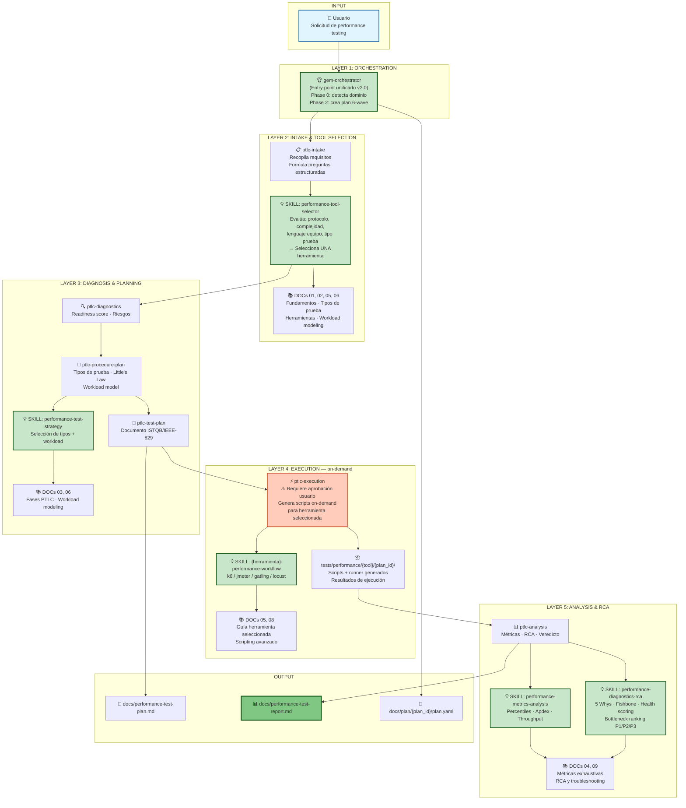

# Mapa de Agentes y Skills - Arquitectura de Ejecución v2.0

## 🤖 Diagrama: gem-orchestrator + Agentes PTLC + Skills + DOCs



---

## 📊 Matriz de Agentes vs Fases PTLC

| Agente | Wave | Entradas | Salidas |
|--------|------|----------|---------|
| `ptlc-intake` | 1 | Request del usuario, DOCs 01/02/05/06 | Requisitos estructurados, herramienta seleccionada |
| `ptlc-diagnostics` | 2 | Requisitos, entorno | Readiness score, riesgos identificados |
| `ptlc-procedure-plan` | 3 | Requisitos, diagnóstico, DOCs 06 | Tipos de prueba, workload model (Little's Law) |
| `ptlc-test-plan` | 4 | Procedure plan, DOCs 03 | `docs/performance-test-plan.md` (ISTQB/IEEE-829) |
| `ptlc-execution` | 5 | Test plan, **aprobación usuario** | Scripts on-demand en `tests/performance/{tool}/{plan_id}/`, resultados |
| `ptlc-analysis` | 6 | Resultados de ejecución, DOCs 04/09 | `docs/performance-test-report.md`, RCA, veredicto |

---

## 📚 DOCs Integration Points

| DOC | Documento | Agentes que lo usan |
|-----|-----------|---------------------|
| 01 | `Definicion_y_Fundamentos.md` | ptlc-intake |
| 02 | `Tipos de Pruebas` | ptlc-intake, ptlc-procedure-plan |
| 03 | `Fases_del_PTLC` | ptlc-test-plan |
| 04 | `Metricas_Exhaustivas.md` | ptlc-analysis |
| 05 | `Herramientas` (k6/JMeter/Gatling/Locust) | ptlc-intake, ptlc-execution |
| 06 | `Workload_Modeling_Exhaustivo.md` | ptlc-procedure-plan |
| 08 | `Scripting_Avanzado.md` | ptlc-execution |
| 09 | `RCA_y_Troubleshooting.md` | ptlc-analysis |
| 10 | `CICD_y_Tendencias_Futuras.md` | ptlc-analysis (roadmap) |

---

## 🔗 Flujo de Control: gem-orchestrator → Agentes → Skills → DOCs

```
USUARIO
    ↓
gem-orchestrator (Phase 0: detecta dominio performance-testing)
    ↓
gem-orchestrator (Phase 2: genera plan 6-wave PTLC)
    ↓ persiste → docs/plan/{plan_id}/plan.yaml

    WAVE 1 → ptlc-intake
        ├─ Lee DOCs 01, 02, 05, 06
        ├─ Formula preguntas al usuario
        ├─ Invoca SKILL: performance-tool-selector
        └─ → Herramienta seleccionada (UNA: k6/JMeter/Gatling/Locust)

    WAVE 2 → ptlc-diagnostics
        ├─ Evalúa entorno y dependencias
        └─ → Readiness score + riesgos

    WAVE 3 → ptlc-procedure-plan
        ├─ Lee DOCs 06 (Workload Modeling)
        ├─ Aplica Little's Law
        └─ → Tipos de prueba + modelo de carga

    WAVE 4 → ptlc-test-plan
        ├─ Lee DOCs 03 (Fases PTLC)
        └─ → docs/performance-test-plan.md

    ⚠️ APPROVAL GATE (gem-orchestrator pide confirmación explícita)

    WAVE 5 → ptlc-execution (solo con aprobación)
        ├─ Lee DOCs 05 (guía herramienta), 08 (scripting)
        ├─ Invoca SKILL: {herramienta}-performance-workflow
        ├─ Genera scripts on-demand en tests/performance/{tool}/{plan_id}/
        └─ → Resultados de ejecución

    WAVE 6 → ptlc-analysis
        ├─ Lee DOCs 04 (métricas), 09 (RCA)
        ├─ Invoca SKILL: performance-metrics-analysis
        ├─ Invoca SKILL: performance-diagnostics-rca
        └─ → docs/performance-test-report.md + veredicto
```

---

## 🎯 Skills por Agente

### gem-orchestrator
- Domain detection (Phase 0)
- Plan generation (Phase 2) — PTLC 6-wave template
- Approval gate (Phase 3B)

### ptlc-intake
- `performance-tool-selector` — evalúa protocolo, complejidad, lenguaje, tipo prueba → selecciona UNA herramienta

### ptlc-procedure-plan
- `performance-test-strategy` — selección de tipos de prueba + Little's Law workload model

### ptlc-execution
- `{herramienta}-performance-workflow` (k6 / jmeter / gatling / locust) — generación de scripts y ejecución

### ptlc-analysis
- `performance-metrics-analysis` — percentiles, Apdex, throughput, error rate
- `performance-diagnostics-rca` — 5 Whys, Fishbone, health scoring, bottleneck ranking P1/P2/P3

---

## ✅ Principios de Arquitectura v2.0

| Principio | Implementación |
|-----------|----------------|
| Entry point único | `gem-orchestrator` recibe todos los requests |
| Una herramienta por ciclo | `ptlc-intake` selecciona UNA herramienta; nunca paralelo |
| Generación on-demand | Scripts generados en Wave 5 — no existen pre-creados |
| Aprobación explícita | `ptlc-execution` no corre sin confirmación del usuario |
| Resultados individuales | Cada ejecución es independiente; no hay comparación cross-tool |
| Estado persistido | `docs/plan/{plan_id}/plan.yaml` guarda el estado de cada ciclo |
| DOCs como fuente de verdad | Cada agente lee los DOCs relevantes antes de actuar |
| Outputs en español | Todos los reportes, planes y comunicaciones en español |
