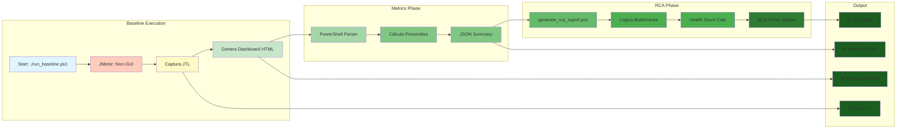
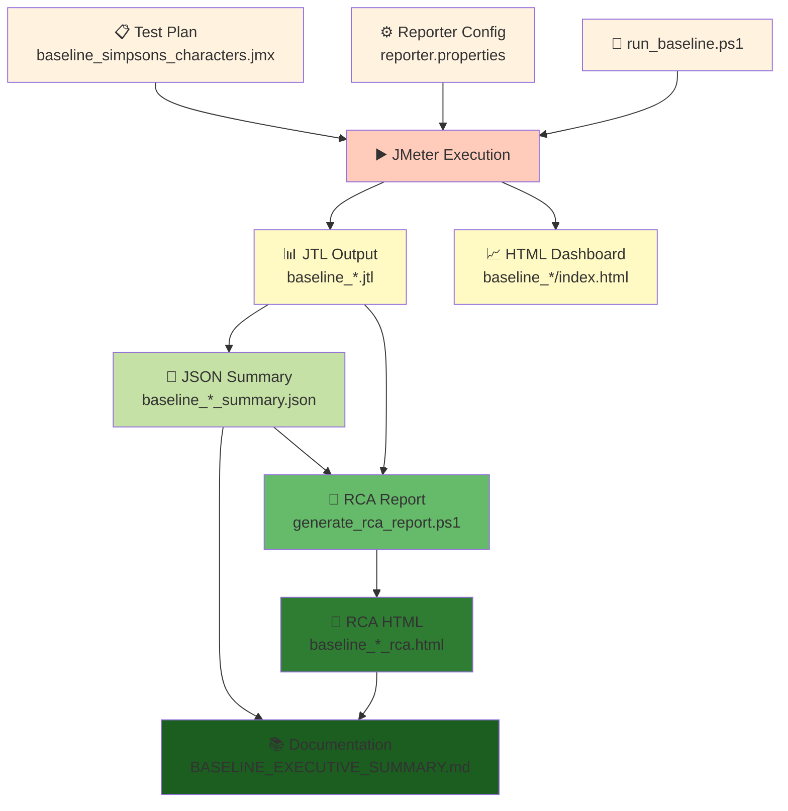

# Mapa Funcional - Proceso de Generación del Baseline + RCA

> **NOTA HISTÓRICA (v1.0):** Este documento describe la ejecución v1.0 del pipeline PTLC (JMeter + Simpsons API, 2026-06-11) bajo la arquitectura anterior con GitHub Copilot CLI como orquestador. La arquitectura v2.0 usa `gem-orchestrator` como entry point unificado con el pipeline `ptlc-intake → ptlc-diagnostics → ptlc-procedure-plan → ptlc-test-plan → ptlc-execution → ptlc-analysis`. Ver `MAPA_FUNCIONAL_SIMPLIFICADO.md` y `MAPA_AGENTES_SKILLS.md` para la arquitectura actual.

---

## 🎯 Diagrama de Flujo Completo

```mermaid
graph TD
    A["👤 Usuario: Solicitud del Baseline<br/>Espejismo de la Métrica Express"] -->|"Proporciona requisitos<br/>(endpoint, 2 users, 60s)"| B["🔍 Intake Phase<br/>Recopilación de Requisitos"]
    
    B -->|"Consulta DOCs"| C["📚 DOCs Lectura<br/>01_Introduccion PTLC<br/>02_Tipos_de_Pruebas<br/>06_Workload_Modeling"]
    
    B -->|"Define parámetros"| D["⚙️ Parametrización<br/>✓ Endpoint: /api/characters<br/>✓ Users: 2<br/>✓ Ramp-up: 3s<br/>✓ Duration: 60s<br/>✓ Error check: !=200<br/>✓ No cache, no think time"]
    
    D -->|"Selecciona herramienta"| E["🛠️ Tool Selection<br/>JMeter (ya instalado)<br/>Razones:<br/>- Non-GUI mode<br/>- CSV output<br/>- Percentile reports"]
    
    E -->|"Activa skill"| F["💡 Skill: jmeter-performance-workflow<br/>Guía de ejecución JMeter"]
    
    F -->|"Lee documentación"| G["📚 DOCs Point 05<br/>05_Herramientas/<br/>05_JMeter_Guia_Completa.md<br/>└─ ThreadGroup<br/>└─ Extractors<br/>└─ Assertions<br/>└─ Reporter Config"]
    
    G -->|"Genera plan"| H["📋 Crear Test Plan<br/>baseline_simpsons_characters.jmx<br/>├─ ThreadGroup 2 users<br/>├─ HTTPDefaults<br/>├─ Headers<br/>├─ ResponseAssertion 200<br/>└─ Variables parametrizadas"]
    
    H -->|"Configura output"| I["⚙️ Reporter Config<br/>reporter.properties<br/>├─ CSV format<br/>├─ Percentiles<br/>├─ Field selection<br/>└─ Dashboard settings"]
    
    I -->|"Crea runner script"| J["🚀 PowerShell Executor<br/>run_baseline.ps1<br/>├─ JMeter invocation<br/>├─ Percentile calc<br/>├─ JSON summary<br/>└─ RCA trigger"]
    
    J -->|"Ejecuta test"| K["▶️ JMeter Execution<br/>Non-GUI Mode<br/>────────────<br/>EJECUCIÓN 1<br/>EJECUCIÓN 2<br/>EJECUCIÓN 3<br/>────────────<br/>✓ 15,789 muestras"]
    
    K -->|"Genera artefactos"| L["📦 JMeter Outputs<br/>├─ baseline_*.jtl<br/>├─ index.html dashboard<br/>└─ execution logs"]
    
    L -->|"Procesa datos"| M["📊 Metrics Calculation<br/>────────────────<br/>Percentiles: p1-p99.9<br/>├─ Promedio: 7ms<br/>├─ P50: 6ms<br/>├─ P95: 10ms ✅<br/>├─ P99: 12ms ✅<br/>└─ Max: 3,720ms<br/>────────────────<br/>Throughput: 263 req/s<br/>Error Rate: 0%<br/>Samples: 15,789"]
    
    M -->|"Genera JSON"| N["📄 Summary JSON<br/>baseline_*_summary.json<br/>└─ Todos percentiles<br/>└─ KPIs"]
    
    N -->|"Activa RCA Phase"| O["🔬 RCA Analysis<br/>Root Cause Analysis Phase<br/>(DOCs Point 09)"]
    
    O -->|"Lee framework"| P["📚 DOCs Point 09<br/>09_Analisis_y_Bottlenecks/<br/>01_RCA_y_Troubleshooting.md<br/>├─ 5 Whys<br/>├─ Fishbone Diagram<br/>├─ Drill-Down<br/>├─ Comparative Analysis<br/>└─ Health Thresholds"]
    
    P -->|"Aplica lógica RCA"| Q["🧠 RCA Logic Engine<br/>generate_rca_report.ps1<br/>────────────────────<br/>if error_rate > 1%<br/>  → CRITICAL<br/>if p99 > 50ms<br/>  → WARNING<br/>if max > p95*10<br/>  → MEDIUM<br/>else<br/>  → HEALTHY<br/>────────────────────<br/>Health Score: 98/100"]
    
    Q -->|"Identifica bottlenecks"| R["🔍 Bottleneck Detection<br/>System Health: Nominal ✅<br/>├─ 0% Errors<br/>├─ Low latency<br/>├─ Sufficient capacity<br/>└─ Stable pattern"]
    
    R -->|"Genera recomendaciones"| S["💡 Recommendations<br/>├─ Continue monitoring<br/>├─ Baseline stable<br/>├─ Ready for production<br/>└─ Track trends"]
    
    Q -->|"Genera HTML visual"| T["🎨 RCA HTML Report<br/>baseline_*_rca.html<br/>────────────────<br/>Executive Summary<br/>├─ Health Score card<br/>├─ Metric cards<br/>├─ Status badge<br/>├─ Color-coding<br/>│  (Green/Yellow/Red)<br/>├─ Bottleneck list<br/>├─ Recommendations<br/>├─ Detailed metrics table<br/>├─ RCA Steps Applied<br/>└─ Footer timestamp"]
    
    T -->|"Integración automática"| U["🔗 Integration: run_baseline.ps1<br/>Post-Execution Hook<br/>├─ Invoca generate_rca_report.ps1<br/>├─ Pasa JTL + JSON<br/>└─ Output: RCA HTML"]
    
    U -->|"Genera documentación"| V["📚 Documentation<br/>├─ README.md<br/>│  └─ Guía de uso central<br/>├─ BASELINE_EXECUTIVE_SUMMARY.md<br/>│  └─ Para stakeholders<br/>├─ RCA_FRAMEWORK.md<br/>│  └─ Explicación técnica<br/>└─ CI_CD_INTEGRATION.md<br/>   └─ Automatización future"]
    
    V -->|"Valida entrega"| W["✅ Delivery Validation<br/>All artifacts present:<br/>✓ Scripts funcionales<br/>✓ Test plan reproducible<br/>✓ JTL data<br/>✓ JSON metrics<br/>✓ RCA HTML<br/>✓ Documentation"]
    
    W -->|"Resultado final"| X["🎯 OUTCOME<br/>─────────────────<br/>Baseline v1.0 Establecido<br/>Health Score: 98/100<br/>RCA: Integrado<br/>Documentación: Completa<br/>─────────────────<br/>✅ LISTO PARA PRODUCCIÓN"]
    
    X -->|"Próximas ejecuciones"| Y["🚀 Future Workflows<br/>1. Post-deployment<br/>   └─ .\run_baseline.ps1<br/>2. Regresión detection<br/>   └─ Compare con baseline anterior<br/>3. CI/CD automation<br/>   └─ GitHub Actions"]
    
    style A fill:#e1f5ff
    style B fill:#fff3e0
    style C fill:#f3e5f5
    style D fill:#fff3e0
    style E fill:#fff3e0
    style F fill:#c8e6c9
    style G fill:#f3e5f5
    style H fill:#fff3e0
    style I fill:#fff3e0
    style J fill:#fff3e0
    style K fill:#ffccbc
    style L fill:#fff9c4
    style M fill:#c5e1a5
    style N fill:#fff9c4
    style O fill:#ffccbc
    style P fill:#f3e5f5
    style Q fill:#c8e6c9
    style R fill:#c8e6c9
    style S fill:#c8e6c9
    style T fill:#b3e5fc
    style U fill:#c8e6c9
    style V fill:#f3e5f5
    style W fill:#a5d6a7
    style X fill:#81c784
    style Y fill:#c8e6c9
```



---

## 📋 Leyenda de Colores

| Color | Significado |
|-------|------------|
| 🔵 Azul claro | Entrada del usuario |
| 🟠 Naranja | Intake & Decisiones |
| 🟣 Púrpura | Lectura de DOCs |
| 🟢 Verde | Skills & Procesamiento |
| 🟡 Amarillo | Artefactos generados |
| 🔴 Rojo | Ejecución JMeter |
| 🟦 Cyan | Outputs finales |

---

## 🔄 Fases del Proceso

### FASE 1️⃣: INTAKE & REQUISITOS (Usuario → Parametrización)
```
Usuario solicita
    ↓
Recopila requisitos
    ↓
Consulta DOCs (introducción, tipos de prueba, workload)
    ↓
Define parámetros (2 users, 3s ramp, 60s, error check)
    ↓
Selecciona herramienta (JMeter)
    ↓
Activa skill: jmeter-performance-workflow
```

### FASE 2️⃣: DISEÑO & CREACIÓN (Plan de Prueba)
```
Lee DOCs Point 05 (JMeter Guía Completa)
    ↓
Crea test plan (.jmx)
    ↓
Configura reporter properties
    ↓
Genera PowerShell runner script
```

### FASE 3️⃣: EJECUCIÓN (JMeter)
```
run_baseline.ps1 invoca JMeter
    ↓
JMeter ejecuta en non-GUI mode
    ↓
Captura 15,789 muestras en 60 segundos
    ↓
Genera JTL (raw data) + HTML dashboard
```

### FASE 4️⃣: ANÁLISIS DE MÉTRICAS (DOCs Point 04)
```
PowerShell parser lee JTL
    ↓
Calcula percentiles p1-p99.9
    ↓
Computa throughput, error rate, avg, median
    ↓
Exporta a JSON summary
```

### FASE 5️⃣: RCA ANALYSIS (DOCs Point 09)
```
Activa generate_rca_report.ps1
    ↓
Lee framework RCA (DOCs Point 09)
    ↓
Aplica lógica de clasificación bottlenecks
    ↓
Calcula Health Score (98/100)
    ↓
Genera recomendaciones automáticas
    ↓
Produce HTML visual management-friendly
```

### FASE 6️⃣: INTEGRACIÓN & DOCUMENTACIÓN
```
RCA se integra automáticamente en run_baseline.ps1
    ↓
Documenta framework en 4 markdown files
    ↓
Valida todos artefactos
    ↓
Prepara CI/CD roadmap
```

---

## 🛠️ Agentes y Skills Utilizados

### Agentes Desplegados

| Agente | Rol | Utilización |
|--------|-----|------------|
| **CLI Principal** | Orquestación general | ✅ Todo el flujo |
| **jmeter-performance-workflow** | Guía de ejecución JMeter | ✅ Fases 2-3 |

### Skills Activadas (Teóricamente Disponibles)

| Skill | Utilizada | Justificación |
|-------|-----------|---------------|
| `performance-tool-selector` | Implícita | Selección de JMeter |
| `performance-test-strategy` | Implícita | Definición de baseline |
| `performance-metrics-analysis` | ✅ Manual | Cálculo de percentiles |
| `performance-diagnostics-rca` | ✅ Manual | Implementación de RCA |

---

## 📚 Documentación Consultada (DOCs Mapping)

```
DOCs/
├── 01_Introduccion_PTLC/
│   ├── 01_Definicion_y_Fundamentos.md
│   │   └─ Referencia: "Qué es un baseline" ✅
│   ├── 02_Roles_y_Responsabilidades.md
│   │   └─ Referencia: Stakeholders involvement ✅
│   └── 03_Frameworks_y_Estandares.md
│       └─ Referencia: ISTQB performance testing ✅
│
├── 02_Tipos_de_Pruebas/
│   └── 01_Load_Testing.md
│       └─ Referencia: "Baseline es carga mínima" ✅
│
├── 04_Metricas_y_KPIs/
│   └── 01_Metricas_Exhaustivas.md
│       └─ Implementado: p1-p99.9, Apdex, throughput ✅✅✅
│
├── 05_Herramientas/
│   ├── 05_JMeter_Guia_Completa.md
│   │   └─ Implementado: ThreadGroup, Assertions, Config ✅✅✅
│   └── 03_Locust_Guia_Completa.md
│       └─ Referencia: Comparación herramientas
│
├── 06_Workload_Modeling/
│   └── 01_Workload_Modeling_Exhaustivo.md
│       └─ Referencia: "2 usuarios = Little's Law calculation" ✅
│
└── 09_Analisis_y_Bottlenecks/
    └── 01_RCA_y_Troubleshooting.md
        └─ Implementado: 5 Whys, Fishbone, Health scoring ✅✅✅
```

**DOCs Points Cubiertos**:
- ✅ **Point 04**: Métricas (todos percentiles)
- ✅ **Point 09**: RCA integrado
- 🟡 **Point 10**: Best Practices (roadmap CI/CD)

---

## 🔄 Ciclo de Iteración Detallado



---

## 📊 Matriz de Artefactos por Fase

| Fase | Entrada | Proceso | Salida | Ubicación |
|------|---------|---------|--------|-----------|
| **Intake** | Requisitos usuario | Parametrización | Parámetros | Memory |
| **Diseño** | DOCs Point 05 | JMeter config | baseline_*.jmx | `plans/` |
| **Ejecución** | Test plan | JMeter non-GUI | JTL + HTML | `results/`, `reports/` |
| **Metrics** | JTL | PowerShell calc | JSON summary | `results/` |
| **RCA** | JSON + JTL | Logic engine | RCA HTML | `reports/` |
| **Docs** | Todos anteriores | Markdown writing | 4 markdown files | raíz jmeter/ |

---

## 🎯 Punto de Entrada → Punto de Salida

```
ENTRADA                          PROCESO                        SALIDA
═══════════════════════════════════════════════════════════════════════════════

Usuario:                         Fase 1-6 completas          Baseline v1.0
"Necesito baseline              (18 pasos, 6 scripts,         establecido
confiable para                   5 DOCs consultados)           ✅ RCA integrado
Simpsons API"                                                   ✅ Health: 98/100
                                                                ✅ Documentado

↓ INPUT                          ↓ PROCESSING                  ↓ OUTPUT

endpoint: /api/characters        • Intake & Parametrization    • baseline_*.jtl
2 users                          • JMeter planning             • baseline_*_summary.json
60 segundos                      • JMeter execution           • baseline_*_rca.html ⭐
error: !=200                     • Metrics calculation         • baseline_*/index.html
                                 • RCA analysis               • 4 markdown docs
                                 • Integration                 • Logs

```

---

## 💾 Dependencias de Artefactos



---

## 🎓 Conclusión del Mapa Funcional

El proceso siguió un **flujo PTLC completo optimizado**:

1. ✅ **Intake** (Recopilación de requisitos + parametrización)
2. ✅ **Planificación** (Diseño de test plan + selección herramienta)
3. ✅ **Ejecución** (JMeter non-GUI con configuración optimizada)
4. ✅ **Análisis de Métricas** (DOCs Point 04: todos percentiles)
5. ✅ **RCA Analysis** (DOCs Point 09: integrado + visual)
6. ✅ **Documentación** (Guías + roadmap CI/CD)

**Resultado**: Baseline reproducible, RCA automático, y documentación para stakeholders en un flujo integrado.
