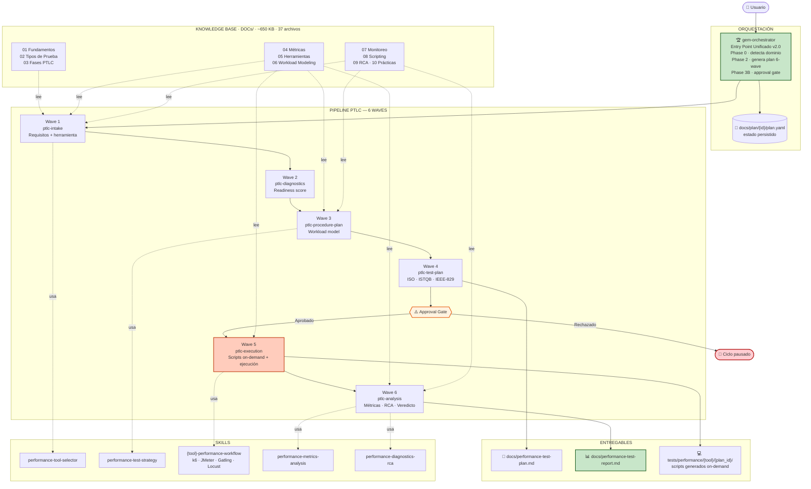
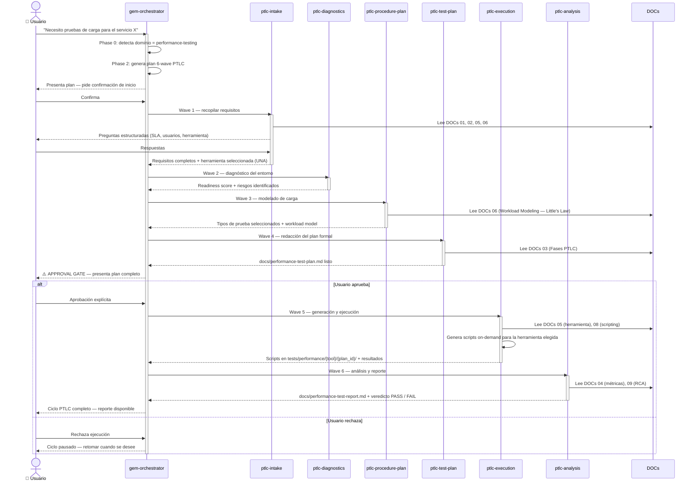

# 📚 Performance Test Life Cycle (PTLC) — Knowledge Base

> **Propósito:** Base de conocimiento exhaustiva sobre Performance Testing.  
> **Navegación:** Este README es el **punto de entrada único** del knowledge base. Desde aquí se navega a los archivos índice de cada categoría (nivel raíz), y desde ellos a los documentos detallados en subcarpetas.  
> **Para agentes AI/MCP:** Leer SOLO este archivo para determinar a dónde dirigirse. No es necesario leer los archivos detallados a menos que se necesite información específica.

---

## 🏗️ Nueva Arquitectura v2.0

El sistema está compuesto por un orquestador central (`gem-orchestrator`), un pipeline PTLC de 6 agentes especializados, 8 skills reutilizables y una base de conocimiento de ~650 KB. Cada ciclo selecciona **una sola herramienta** de testing y genera todos los scripts **on-demand**.



---

## 🔄 Explicación Funcional

Cómo fluye una solicitud de performance testing de extremo a extremo, desde el pedido del usuario hasta el reporte final con veredicto PASS/FAIL.



> **Principios clave:**
> - `gem-orchestrator` es el **único entry point** — detecta automáticamente la intención de performance testing.
> - Cada ciclo PTLC elige **una sola herramienta** (k6, JMeter, Gatling o Locust). No hay ejecución paralela multi-tool.
> - Los scripts se generan **on-demand** en Wave 5 — no existen scripts pre-creados en el repositorio.
> - La ejecución real de pruebas requiere **aprobación explícita** del usuario (Wave 5).
> - El estado de cada ciclo se persiste en `docs/plan/{plan_id}/plan.yaml`.

---

## 🗺️ Arquitectura de Navegación (3 Niveles)

```
NIVEL 1 → README.md (ESTÁS AQUÍ)
           Master Index: lookup global por necesidad, keyword o categoría
           │
NIVEL 2 → Archivos índice en DOCs/ (01-10_*.md)
           Índices intermedios: resumen del tema + tabla de contenido de subcarpeta
           Suficiente para entender el alcance sin leer el detalle
           │
NIVEL 3 → Subcarpetas en DOCs/ (01_Introduccion_PTLC/ ... 10_Mejores_Practicas/)
           Documentación exhaustiva con código, ejemplos, templates
           Solo leer cuando se necesita el detalle completo
```

---

## 🔍 Lookup Rápido por Necesidad

| Necesito... | Ir a (Nivel 2) → |
|-------------|-------------------|
| Entender qué es el PTLC, fases generales, roles, estándares | [01_Introduccion_PTLC.md](DOCs/01_Introduccion_PTLC.md) |
| Saber qué tipo de prueba usar para mi caso | [02_Tipos_de_Pruebas_de_Rendimiento.md](DOCs/02_Tipos_de_Pruebas_de_Rendimiento.md) |
| Ejecutar las fases del ciclo (requisitos → cierre) | [03_Fases_del_PTLC_Detalle.md](DOCs/03_Fases_del_PTLC_Detalle.md) |
| Métricas, KPIs, fórmulas, percentiles, Apdex | [04_Metricas_y_KPIs.md](DOCs/04_Metricas_y_KPIs.md) |
| Elegir o usar una herramienta (k6, JMeter, Gatling, Locust) | [05_Herramientas_de_Performance_Testing.md](DOCs/05_Herramientas_de_Performance_Testing.md) |
| Modelar carga, calcular VUs, Little's Law, distribuciones | [06_Workload_Modeling_y_Diseno_de_Escenarios.md](DOCs/06_Workload_Modeling_y_Diseno_de_Escenarios.md) |
| Monitoreo, Prometheus, Grafana, OpenTelemetry, alerting | [07_Entorno_y_Monitoreo.md](DOCs/07_Entorno_y_Monitoreo.md) |
| Scripting avanzado, correlación, patrones, data management | [08_Desarrollo_de_Scripts.md](DOCs/08_Desarrollo_de_Scripts.md) |
| Analizar resultados, RCA, troubleshooting, profiling | [09_Analisis_de_Resultados_y_Bottlenecks.md](DOCs/09_Analisis_de_Resultados_y_Bottlenecks.md) |
| Best practices, CI/CD, errores comunes, tendencias futuras | [10_Mejores_Practicas_y_Errores_Comunes.md](DOCs/10_Mejores_Practicas_y_Errores_Comunes.md) |

---

## 🔑 Lookup por Keyword / Tema Específico

> Para ir directo al archivo detallado (Nivel 3) sin pasar por el índice intermedio.

### Fundamentos y Contexto
| Keyword | Archivo directo (Nivel 3) |
|---------|---------------------------|
| NFRs, requisitos no funcionales, SLAs, glosario | `DOCs/01_Introduccion_PTLC/01_Definicion_y_Fundamentos.md` |
| Roles, RACI, equipo de performance, career path | `DOCs/01_Introduccion_PTLC/02_Roles_y_Responsabilidades.md` |
| ISO 25010, ISTQB, TMMi, Google SRE, compliance | `DOCs/01_Introduccion_PTLC/03_Frameworks_y_Estandares.md` |

### Tipos de Pruebas (22+ tipos)
| Keyword | Archivo directo (Nivel 3) |
|---------|---------------------------|
| Load testing, pruebas de carga, carga esperada | `DOCs/02_Tipos_de_Pruebas/01_Load_Testing.md` |
| Stress testing, breaking point, degradación | `DOCs/02_Tipos_de_Pruebas/02_Stress_Testing.md` |
| Soak, endurance, spike, volume, scalability, Amdahl | `DOCs/02_Tipos_de_Pruebas/03_Endurance_Spike_Volume_Scalability.md` |
| **Baseline**, iteración, CV, estabilidad, referencia | `DOCs/02_Tipos_de_Pruebas/04_Baseline_Testing.md` |
| Smoke, peak, capacity, breakpoint, concurrency, reliability | `DOCs/02_Tipos_de_Pruebas/05_Smoke_Peak_Capacity_Breakpoint.md` |
| Configuration, failover, recovery, regression, network, API, browser, isolation, saturation | `DOCs/02_Tipos_de_Pruebas/06_Configuration_Failover_Recovery_Regression_y_Otros.md` |
| **Resiliency**, chaos engineering, circuit breaker, bulkhead, fault injection, game days | `DOCs/02_Tipos_de_Pruebas/07_Resiliency_Testing.md` |

### Fases del PTLC
| Keyword | Archivo directo (Nivel 3) |
|---------|---------------------------|
| Requisitos, workshops, stakeholders, priorización | `DOCs/03_Fases_del_PTLC/01_Recopilacion_de_Requisitos.md` |
| Plan de pruebas, diseño, alcance, workload model | `DOCs/03_Fases_del_PTLC/02_Planificacion_y_Diseno.md` |
| Entorno, IaC, scripts, ejecución, runbooks | `DOCs/03_Fases_del_PTLC/03_Entorno_Scripts_Ejecucion.md` |
| Reporting, optimización, re-testing, sign-off, retrospectiva | `DOCs/03_Fases_del_PTLC/04_Analisis_Optimizacion_Cierre.md` |

### Métricas y Cálculos
| Keyword | Archivo directo (Nivel 3) |
|---------|---------------------------|
| Response time, throughput, error rate, percentiles, p95, p99, Apdex, Little's Law, CPU, memory | `DOCs/04_Metricas_y_KPIs/01_Metricas_Exhaustivas.md` |

### Herramientas
| Keyword | Archivo directo (Nivel 3) | Tamaño |
|---------|---------------------------|--------|
| k6 referencia rápida, intro k6 | `DOCs/05_Herramientas/01_k6_Guia_Completa.md` | 14 KB |
| Comparativa herramientas, decision matrix, cuál elegir | `DOCs/05_Herramientas/02_JMeter_Gatling_Locust.md` | 14 KB |
| **Locust**: greenlets, custom shapes, distributed, FastHttpUser, gRPC, WebSocket, MQTT | `DOCs/05_Herramientas/03_Locust_Guia_Completa.md` | 97 KB |
| **Gatling CE**: Java/Kotlin/Scala DSL, injection profiles, open/closed model, feeders, recorder | `DOCs/05_Herramientas/04_Gatling_Community_Guia_Completa.md` | 95 KB |
| **JMeter**: thread groups, samplers, extractors, correlation, JSR223/Groovy, distributed, plugins | `DOCs/05_Herramientas/05_JMeter_Guia_Completa.md` | 69 KB |
| **k6 exhaustivo**: executors, scenarios, custom metrics, SharedArray, xk6, browser, Grafana Cloud | `DOCs/05_Herramientas/06_k6_Guia_Completa_Expandida.md` | 73 KB |

### Workload, Monitoreo, Scripts, Análisis, Prácticas
| Keyword | Archivo directo (Nivel 3) |
|---------|---------------------------|
| Little's Law, VU calculation, distribuciones, patrones de tráfico, template YAML | `DOCs/06_Workload_Modeling/01_Workload_Modeling_Exhaustivo.md` |
| Prometheus, Grafana, PromQL, OpenTelemetry, Jaeger, alerting, Docker Compose stack | `DOCs/07_Entorno_y_Monitoreo/01_Monitoreo_y_Observabilidad.md` |
| Scripting patterns, chain requests, token refresh, WebSocket, GraphQL, error handling | `DOCs/08_Desarrollo_de_Scripts/01_Scripting_Avanzado.md` |
| 5 Whys, Fishbone, drill-down, decision trees, profiling, DB query bottlenecks | `DOCs/09_Analisis_y_Bottlenecks/01_RCA_y_Troubleshooting.md` |
| CI/CD pipelines, performance budgets, shift-left, microservicios, K8s, AI/ML, tendencias | `DOCs/10_Mejores_Practicas/01_CICD_y_Tendencias_Futuras.md` |

---

## 📊 Estadísticas del Knowledge Base

| Métrica | Valor |
|---------|-------|
| Total de documentos | 37 archivos markdown |
| Estructura | 11 índices (README + 10 root) → 26 detallados en subcarpetas |
| Carpetas temáticas | 10 |
| Contenido total | ~650 KB |
| Herramientas con guía exhaustiva | k6, JMeter, Gatling CE, Locust |
| Tipos de pruebas documentados | 22+ |
| Lenguajes con código ejemplo | JavaScript, Java, Kotlin, Scala, Python, Groovy, XML, Bash, SQL, YAML, Terraform, PromQL |

---

## 🧭 Flujos de Lectura Recomendados

### 🟢 Aprender desde cero
```
README → DOCs/01_Introduccion_PTLC.md → DOCs/01_Introduccion_PTLC/01_Definicion_y_Fundamentos.md
       → DOCs/02_Tipos_de_Pruebas_de_Rendimiento.md → elegir tipos relevantes
       → DOCs/03_Fases_del_PTLC_Detalle.md → seguir 01→04 en orden
```

### 🔵 Elegir herramienta para un proyecto
```
README → DOCs/05_Herramientas_de_Performance_Testing.md → DOCs/05_Herramientas/02_JMeter_Gatling_Locust.md (comparativa rápida)
       → Guía exhaustiva de la herramienta elegida (03, 04, 05 o 06)
```

### 🟡 Iniciar un proyecto nuevo de performance testing
```
README → DOCs/03_Fases_del_PTLC_Detalle.md → 01_Recopilacion → 02_Planificacion
       → DOCs/06_Workload_Modeling_y_Diseno_de_Escenarios.md → calcular VUs y modelo de carga
       → DOCs/05_Herramientas_de_Performance_Testing.md → seleccionar herramienta
       → DOCs/04_Metricas_y_KPIs.md → definir criterios pass/fail
```

### 🔴 Troubleshooting / análisis post-ejecución
```
README → DOCs/09_Analisis_de_Resultados_y_Bottlenecks.md → DOCs/09_Analisis_y_Bottlenecks/01_RCA_y_Troubleshooting.md
       → DOCs/07_Entorno_y_Monitoreo.md → verificar observabilidad
       → DOCs/04_Metricas_y_KPIs.md → revisar qué métricas analizar
```

### 🟣 Configurar CI/CD con performance testing
```
README → DOCs/10_Mejores_Practicas_y_Errores_Comunes.md → DOCs/10_Mejores_Practicas/01_CICD_y_Tendencias_Futuras.md
       → DOCs/05_Herramientas_de_Performance_Testing.md → sección CI/CD de la herramienta elegida
```

---

## 📐 Diagrama del Performance Test Life Cycle

```mermaid
flowchart LR
    R1["1️⃣ Requisitos\nNFRs · SLAs\nStakeholders"]
    R2["2️⃣ Planificación\nPlan de pruebas\nWorkload model"]
    R3["3️⃣ Diseño\nTipos de prueba\nEscenarios"]
    R4["4️⃣ Entorno & Setup\nInfraestructura\nMonitoreo"]
    R5["5️⃣ Scripts\nDesarrollo\nValidación"]
    R6["6️⃣ Ejecución\nRuns · Resultados\nArtefactos"]
    R7["7️⃣ Análisis\nMétricas · RCA\nBottlenecks"]
    R8["8️⃣ Optimización\nFix · Retest\nValidación"]
    R9["9️⃣ Cierre & Reporte\nSign-off · Lessons\nBaseline final"]

    LOOP(["🔁 Iterar si falla\nbaseline → validate"])

    R1 --> R2 --> R3 --> R4 --> R5 --> R6 --> R7 --> R8 --> R9
    R8 -->|"re-test"| R6
    R9 --> LOOP

    style R6 fill:#ffccbc,stroke:#bf360c,stroke-width:2px
    style R7 fill:#c8e6c9,stroke:#1b5e20,stroke-width:2px
    style R9 fill:#c8e6c9,stroke:#1b5e20,stroke-width:2px
    style LOOP fill:#e3f2fd,stroke:#1565c0,stroke-width:2px
```



---

*Knowledge Base del proyecto PerfInit — Última actualización: Junio 2026*
