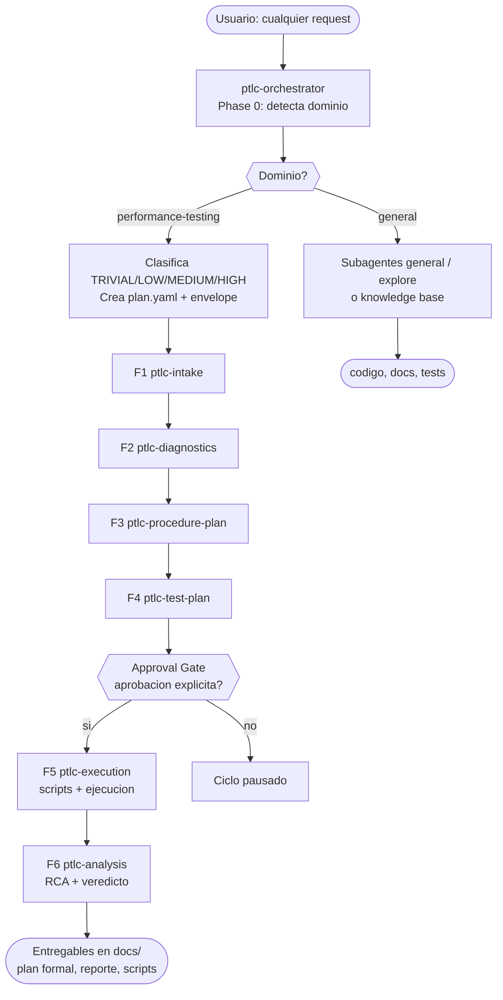
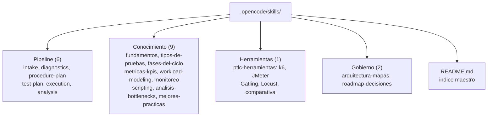

# 02 — Arquitectura

## Estructura del repositorio

```text
/
├── AGENTS.md                  # Guía persistente para agentes (reglas, tokens, entregables)
├── opencode.json              # default_agent: ptlc-orchestrator
├── .opencode/
│   ├── agents/
│   │   └── ptlc-orchestrator.md   # Único agente: entry point + orquestador
│   └── skills/                    # Knowledge base PTLC (18 skills)
│       ├── README.md              # Índice maestro (Nivel 1)
│       ├── ptlc-intake/           # Wave 1 · requisitos + tool selection
│       ├── ptlc-diagnostics/      # Wave 2 · readiness + riesgos
│       ├── ptlc-procedure-plan/   # Wave 3 · tipos + workload model
│       ├── ptlc-test-plan/        # Wave 4 · plan formal ISTQB/IEEE-829
│       ├── ptlc-execution/        # Wave 5 · scripts + ejecución (con aprobación)
│       ├── ptlc-analysis/         # Wave 6 · métricas + RCA + reporte
│       ├── ptlc-fundamentos/ ptlc-tipos-de-pruebas/ ptlc-fases-del-ciclo/
│       ├── ptlc-metricas-kpis/ ptlc-workload-modeling/ ptlc-monitoreo/
│       ├── ptlc-scripting/ ptlc-analisis-bottlenecks/ ptlc-mejores-practicas/
│       ├── ptlc-herramientas/     # Guías k6, JMeter, Gatling, Locust + comparativa
│       ├── ptlc-arquitectura-mapas/   # MAP.md (diagramas) + AGENTS.md (convenciones)
│       └── ptlc-roadmap-decisiones/   # PRD.yaml + CONTEXT_ENVELOPE.md
├── docs/                      # Esta documentación + entregables por ciclo
│   └── plan/{plan_id}/        # plan.yaml + context_envelope.json (estado activo)
├── scripts/
│   └── measure_tokens.py      # Medición del presupuesto de tokens
└── tests/performance/{tool}/  # Scripts generados on-demand (Wave 5)
```

Cada skill temática sigue `SKILL.md` (índice, Nivel 2) + `NN_Tema.md` (detalle, Nivel 3).

## Componentes y responsabilidades

| Componente | Responsabilidad |
|------------|-----------------|
| `ptlc-orchestrator` | Detecta dominio (Phase 0), planifica (plan.yaml + envelope), carga una skill por fase, persiste estado, comunica progreso |
| Skills pipeline (6) | Procedimiento autoritativo de cada fase: lecturas obligatorias, workflow, formato de salida |
| Skills conocimiento (12) | Fuente de verdad temática; nunca ejecutan el ciclo por sí solas |
| Subagentes `general` / `explore` | Resuelven requests no-PTLC (multi-paso / exploración del repo) |
| `plan.yaml` + `context_envelope.json` | Estado resumible del ciclo; evita releer documentos ya sintetizados |
| `measure_tokens.py` | Valida: activo ≤1.400, agente ≤3.200, `SKILL.md` ≤2.000, detalle ≤6.000 tokens |

## Flujo de un request (extremo a extremo)



## Mapa de carpetas `.opencode/skills`



Detalle completo en [MAP.md](../.opencode/skills/ptlc-arquitectura-mapas/MAP.md). Agente en [03](03-agente-orquestador.md).
