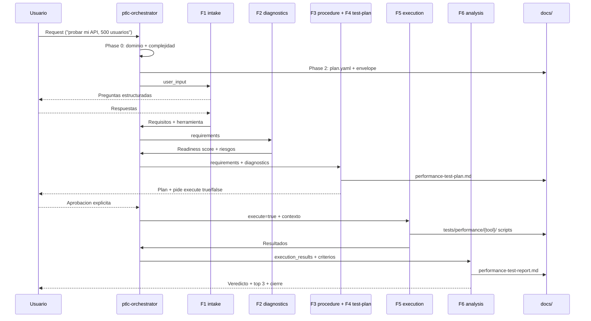

# 03 — Agente orquestador (`ptlc-orchestrator`)

Definición: [`.claude/agents/ptlc-orchestrator.md`](../.claude/agents/ptlc-orchestrator.md). La memoria del proyecto ([`CLAUDE.md`](../CLAUDE.md)) lo fija como entry point obligatorio; [`.claude/settings.json`](../.claude/settings.json) contiene los permisos del harness.

## Rol y reglas

- **Entry point obligatorio:** todo request entra por él; no se le salta ni se reordena su flujo.
- **Orquestación pura:** carga la skill correcta en el momento correcto, pasa el contexto acumulado, sintetiza resultados y gestiona el estado. No ejecuta lógica de fase por su cuenta.
- **No improvisar:** cada fase ejecuta el procedimiento de su skill `ptlc-*` (incluido su `<pre_execution>`). Si una skill falla 3 veces, escala al usuario.
- **Dominio dual:** `performance-testing` → pipeline de 6 fases; `general` → subagentes integrados (`general-purpose` multi-paso, `Explore` exploración) o knowledge base.
- **Usuario:** muestra progreso (`Fase 2/6…`) y resumen legible tras cada fase; pregunta solo ante decisiones bloqueantes.
- **Ejecución con aprobación:** la Wave 5 requiere confirmación explícita (impacto real sobre infraestructura).

## Phase 0 — Init & Clarify

1. Detecta el dominio. Si no es performance-testing, delega y termina el flujo PTLC.
2. Revisa `tests/performance/{selected_tool}/{plan_id}/plan.yaml` si hay `plan_id`: inicio nuevo, plan existente o una sola fase.
3. Genera `plan_id` con formato `YYYYMMDD-nombre-sistema` si es nuevo.
4. **Gate de clarificación:** solo pregunta ante ambigüedad bloqueante; con input mínimo procede (el intake ya pregunta).
5. **Clasifica complejidad:** TRIVIAL (consulta puntual) · LOW (una o dos fases) · MEDIUM/HIGH (ciclo completo, flujo normal).

## Phase 1 — Route

| Caso | Acción |
|------|--------|
| Plan existente sin cambios | Retoma desde la última fase incompleta |
| Plan existente + feedback | Ajusta desde la fase afectada |
| Nuevo | Inicia desde Fase 1 (intake) |

## Phase 2 — Plan (MEDIUM/HIGH)

Crea `tests/performance/{selected_tool}/{plan_id}/plan.yaml` (6 fases en cascada) y `context_envelope.json` (bloques vacíos según `CONTEXT_ENVELOPE.md`):

```yaml
plan_id: "{plan_id}"
objective: "{objetivo del usuario}"
complexity: MEDIUM
phases:
  - {id: phase-1-intake, skill: ptlc-intake}
  - {id: phase-2-diagnostics, skill: ptlc-diagnostics, depends_on: [phase-1-intake]}
  - {id: phase-3-procedure, skill: ptlc-procedure-plan, depends_on: [phase-2-diagnostics]}
  - {id: phase-4-test-plan, skill: ptlc-test-plan, depends_on: [phase-3-procedure]}
  - {id: phase-5-execution, skill: ptlc-execution, depends_on: [phase-4-test-plan], requires_approval: true}
  - {id: phase-6-analysis, skill: ptlc-analysis, depends_on: [phase-5-execution]}
```

## Phase 3 — Ejecución por skills (F1–F6)

Payload genérico: `plan_id`, `objective` y `task_definition` (input + snapshot de contexto). Tras cada fase: marca `completed`, persiste el bloque en el envelope (`meta.last_updated`) y pasa `plan.yaml` + envelope a la siguiente.

| Fase | Skill | Entrada clave | Gate / salida |
|------|-------|---------------|---------------|
| F1 | `ptlc-intake` | `user_input` | `needs_more_info` → pregunta y re-ejecuta hasta `completed` |
| F2 | `ptlc-diagnostics` | requisitos (F1) | `blocked` si readiness < 50 → espera confirmación; si no, score + top 3 riesgos |
| F3 | `ptlc-procedure-plan` | F1 + F2 | Tipos de prueba, orden y estimado; pregunta si ajusta alcance |
| F4 | `ptlc-test-plan` | F1–F3 | Genera `tests/performance/{selected_tool}/{plan_id}/performance-test-plan.md`; pide `execute: true/false` |
| F5 | `ptlc-execution` | `execute` + contexto | Requiere aprobación; smoke fallido → pausa y espera instrucciones |
| F6 | `ptlc-analysis` | resultados + criterios | Veredicto PASSED/CONDITIONAL/FAILED + `tests/performance/{selected_tool}/{plan_id}/performance-test-report.md` |

## Phase 4 — Output final

Cierre con veredicto, entregables, top 3 recomendaciones y estado por fase (formato de `ptlc-analysis`).

## Knowledge sources que consulta

`README.md` (índice maestro) · `ptlc-fases-del-ciclo/SKILL.md` · `ptlc-arquitectura-mapas/CONVENTIONS.md` · `ptlc-roadmap-decisiones/PRD.yaml` · `plan.yaml` + `context_envelope.json` (contrato en `CONTEXT_ENVELOPE.md`) · plan y reporte generados (si existen).

## Ciclo completo



Volver: [README](README.md) · [01](01-vision-general.md) · [02](02-arquitectura.md).
