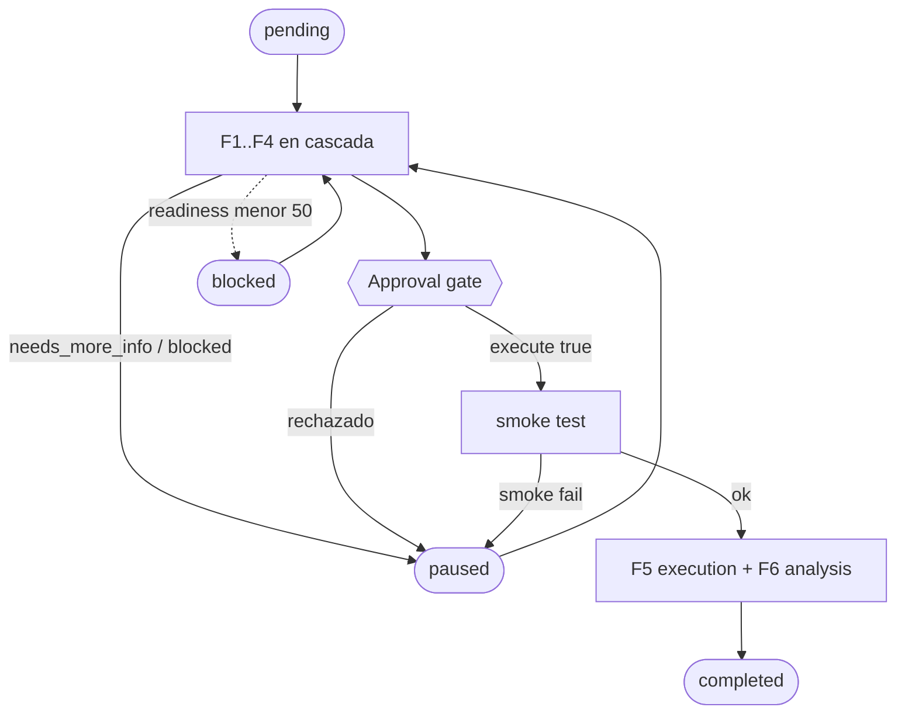

# 04 — Pipeline PTLC: las 6 fases en detalle

Orquestador: `ptlc-orchestrator` (entry point obligatorio). Detecta el dominio en Phase 0 y ejecuta las 6 fases en cascada, una skill por fase. Ver [02-arquitectura](02-arquitectura.md) · [05-skills](05-skills.md) · [06-knowledge-base](06-knowledge-base.md).

> Rutas de skills: `../.claude/skills/<skill>/SKILL.md`. Contrato del contexto: `../.claude/skills/ptlc-roadmap-decisiones/CONTEXT_ENVELOPE.md`.

## F1 · Intake — requisitos + selección de herramienta

- **Skill:** `../.claude/skills/ptlc-intake/SKILL.md`
- **Objetivo:** recopilar SUT, NFRs, contexto del equipo y datos; seleccionar UNA herramienta.
- **Inputs:** `user_input` (+ `context_snapshot` si existe).
- **Outputs:** JSON `requirements` + `selected_tool` + `pending_questions`; escribe bloque `intake` del envelope.
- **Gate:** `status = needs_more_info` → presentar `pending_questions` al usuario y re-ejecutar hasta `completed`.

## F2 · Diagnostics — readiness + riesgos

- **Skill:** `../.claude/skills/ptlc-diagnostics/SKILL.md`
- **Objetivo:** viabilidad técnica: entorno, observabilidad, datos, NFRs; workload estimado con Little's Law.
- **Inputs:** `requirements` de F1.
- **Outputs:** `readiness_score` (0-100) + riesgos + `preparation_actions`; bloque `diagnostics`.
- **Gate:** `readiness_score < 50` → `status = blocked`; escalar issues bloqueantes y re-evaluar.

## F3 · Procedure plan — tipos + workload model

- **Skill:** `../.claude/skills/ptlc-procedure-plan/SKILL.md`
- **Objetivo:** definir QUÉ hacer: tipos (máx 5), escenarios, workload model, criterios numéricos.
- **Inputs:** `requirements` + `diagnostics_output`.
- **Outputs:** `test_types` + `workload_model` (nominal/pico/stress, Little's Law) + `execution_order`; bloque `procedure`.
- **Gate:** orden Smoke → Baseline → Load → Stress/Spike → Soak; preguntar si ajusta el alcance.

## F4 · Test plan — documento formal ISTQB/IEEE-829

- **Skill:** `../.claude/skills/ptlc-test-plan/SKILL.md`
- **Objetivo:** plan de 11 secciones legible por stakeholders; genera `docs/performance-test-plan.md`.
- **Inputs:** fases 1-3 (`requirements` + `diagnostics` + `procedure_plan`).
- **Outputs:** JSON resumen + archivo del plan; bloque `test_plan`.
- **Gate:** pedir revisión del plan y confirmar `execute: true | false`.

## Approval gate (entre F4 y F5)

`ptlc-orchestrator` presenta el plan y espera confirmación explícita. Aprobado → F5; rechazado → ciclo pausado (no se ejecuta nada).

## F5 · Execution — scripts + ejecución

- **Skill:** `../.claude/skills/ptlc-execution/SKILL.md`
- **Objetivo:** generar scripts on-demand en `tests/performance/{tool}/{plan_id}/` y ejecutar si `execute = true`.
- **Inputs:** plan completo + `execute` (booleano aprobado) + herramienta seleccionada.
- **Outputs:** `scripts_generated` + `execution_results`; bloque `execution`.
- **Gate:** sin aprobación → `skipped_execution` (solo scripts). Smoke test primero (2-3 min); si falla, pausar y no continuar.

## F6 · Analysis — métricas + RCA + veredicto

- **Skill:** `../.claude/skills/ptlc-analysis/SKILL.md`
- **Objetivo:** p50/p95/p99, Apdex, throughput, error rate vs criterios; RCA con 5 Whys; reporte en `docs/performance-test-report.md`.
- **Inputs:** `execution_results` + `acceptance_criteria`.
- **Outputs:** `overall_verdict` + métricas por prueba + bottlenecks P1-P4; bloque `analysis`.
- **Gate (veredicto):** `PASSED` (todo cumplido) · `CONDITIONAL` (fallas P3-P4 con follow-up) · `FAILED` (falla P1/P2, no ir a producción).

## Diagrama de estados



## `plan.yaml` de ejemplo

Estructura creada por `ptlc-orchestrator` en Phase 2 (`docs/plan/{plan_id}/plan.yaml`):

```yaml
plan_id: "20261003-api-pagos"
objective: "carga al API de pagos; 500 usuarios"
complexity: MEDIUM
phases:
  - {id: phase-1-intake, skill: ptlc-intake}
  - {id: phase-2-diagnostics, skill: ptlc-diagnostics, depends_on: [phase-1-intake]}
  - {id: phase-3-procedure, skill: ptlc-procedure-plan, depends_on: [phase-2-diagnostics]}
  - {id: phase-4-test-plan, skill: ptlc-test-plan, depends_on: [phase-3-procedure]}
  - {id: phase-5-execution, skill: ptlc-execution, depends_on: [phase-4-test-plan], requires_approval: true}
  - {id: phase-6-analysis, skill: ptlc-analysis, depends_on: [phase-5-execution]}
```

`plan.yaml` = estado de fases (`pending`/`completed`/`blocked`/`paused`); `context_envelope.json` = conclusiones. Detalle en [05-skills](05-skills.md).
