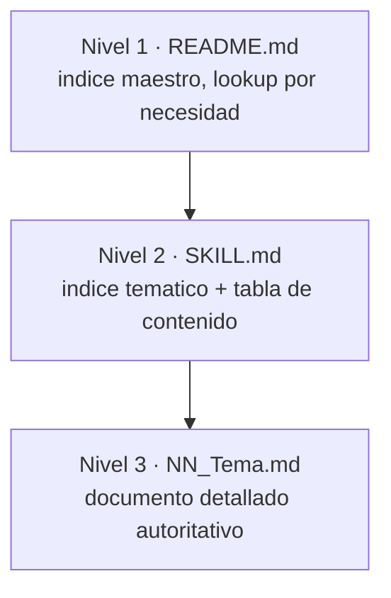

# 05 — Catálogo de skills (18)

Índice maestro: `../.opencode/skills/README.md`. Pipeline en [04-pipeline-ptlc](04-pipeline-ptlc.md) · contenido temático en [06-knowledge-base](06-knowledge-base.md).

## Skills de pipeline (6)

Invocadas en orden por `ptlc-orchestrator`. Cada una = procedimiento completo de su fase (lecturas, workflow, output JSON, reglas).

| Skill | Wave | Rol |
|-------|------|-----|
| [ptlc-intake](../.opencode/skills/ptlc-intake/SKILL.md) | 1 | Requisitos + selección de herramienta |
| [ptlc-diagnostics](../.opencode/skills/ptlc-diagnostics/SKILL.md) | 2 | Diagnóstico técnico + readiness score |
| [ptlc-procedure-plan](../.opencode/skills/ptlc-procedure-plan/SKILL.md) | 3 | Tipos de prueba + workload model |
| [ptlc-test-plan](../.opencode/skills/ptlc-test-plan/SKILL.md) | 4 | Plan formal ISTQB/IEEE-829 |
| [ptlc-execution](../.opencode/skills/ptlc-execution/SKILL.md) | 5 | Scripts + ejecución (requiere aprobación) |
| [ptlc-analysis](../.opencode/skills/ptlc-analysis/SKILL.md) | 6 | Métricas + RCA + reporte final |

## Skills temáticas (12)

Knowledge base (~48 documentos). Detalle por skill en [06-knowledge-base](06-knowledge-base.md).

| Skill | Tema | Documentos |
|-------|------|------------|
| [ptlc-fundamentos](../.opencode/skills/ptlc-fundamentos/SKILL.md) | PTLC, NFRs, RACI, ISO 25010/ISTQB | 3 |
| [ptlc-tipos-de-pruebas](../.opencode/skills/ptlc-tipos-de-pruebas/SKILL.md) | 22+ tipos de prueba | 9 (incl. `07_Resiliency_Testing/`) |
| [ptlc-fases-del-ciclo](../.opencode/skills/ptlc-fases-del-ciclo/SKILL.md) | 9 fases del ciclo | 4 |
| [ptlc-metricas-kpis](../.opencode/skills/ptlc-metricas-kpis/SKILL.md) | Percentiles, Apdex, throughput | 2 (1 cheat + 1 exhaustivo) |
| [ptlc-herramientas](../.opencode/skills/ptlc-herramientas/SKILL.md) | k6, JMeter, Gatling, Locust + comparativa | 7 (4 guías + común + comparativa + cheat) |
| [ptlc-workload-modeling](../.opencode/skills/ptlc-workload-modeling/SKILL.md) | Little's Law, VUs, patrones | 2 (1 cheat + 1 exhaustivo) |
| [ptlc-monitoreo](../.opencode/skills/ptlc-monitoreo/SKILL.md) | Prometheus, Grafana, OTel, Jaeger | 1 |
| [ptlc-scripting](../.opencode/skills/ptlc-scripting/SKILL.md) | Correlación, WebSocket, GraphQL | 1 |
| [ptlc-analisis-bottlenecks](../.opencode/skills/ptlc-analisis-bottlenecks/SKILL.md) | RCA: 5 Whys, Fishbone | 1 |
| [ptlc-mejores-practicas](../.opencode/skills/ptlc-mejores-practicas/SKILL.md) | CI/CD, shift-left, tendencias | 1 |
| [ptlc-arquitectura-mapas](../.opencode/skills/ptlc-arquitectura-mapas/SKILL.md) | Mapas + convenciones `AGENTS.md` | 2 (`MAP.md`, `AGENTS.md`) |
| [ptlc-roadmap-decisiones](../.opencode/skills/ptlc-roadmap-decisiones/SKILL.md) | PRD + contexto acumulado | 2 (`PRD.yaml`, `CONTEXT_ENVELOPE.md`) |

## Modelo de 3 niveles

Reglas: ante duda leer Nivel 2 antes que Nivel 3; Nivel 3 usa naming `NN_Topic_Name.md`; no duplicar docs (actualizar el existente); al mover/renombrar, actualizar `README.md` y el `SKILL.md` padre. Toda skill de fase con `<pre_execution>` debe leer lo listado antes de operar.

## Mecanismo `context_envelope.json`

- **Qué es:** JSON por `plan_id` en `docs/plan/{plan_id}/context_envelope.json` con conclusiones sintetizadas; evita releer documentos ya sintetizados.
- **Contrato:** `../.opencode/skills/ptlc-roadmap-decisiones/CONTEXT_ENVELOPE.md`.
- **Bloque por fase:** F1→`intake`, F2→`diagnostics`, F3→`procedure`, F4→`test_plan`, F5→`execution`, F6→`analysis`; `meta` lo crea el orquestador y cada fase actualiza `meta.last_updated`.
- **Regla de oro:** cada fase escribe SOLO su bloque; nunca borra ni reescribe bloques ajenos.
- **`plan.yaml` vs envelope:** `plan.yaml` = estado (wave, status, depends_on, lo gestiona el orquestador); envelope = conclusiones (lo escriben las skills).
