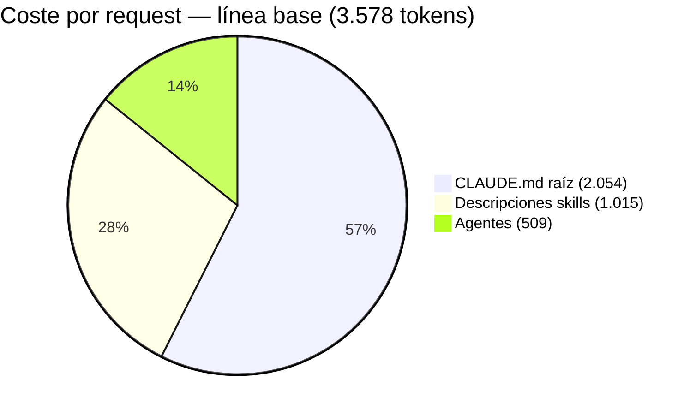
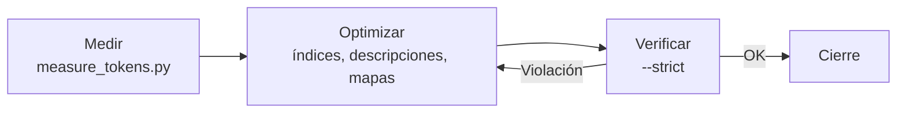

# 07 · Optimización de tokens

Historia y resultados del plan de optimización de tokens del knowledge base PTLC. Medición con `../scripts/measure_tokens.py` (estima `caracteres / 3.5`).

## 1. Línea base

Contexto por request: **3.578 tokens**, repartido así:

- `CLAUDE.md` (raíz; antes `AGENTS.md`): **2.054**
- Descripciones de skills: **1.015**
- Agentes: **509**

Resto del KB:

- KB total: **232.633 tokens** (~795 KB, 61 archivos).
- Lecturas obligatorias por ciclo PTLC: **~186.444 tokens**.
- `gem-orchestrator`: **7.434**; `gem-planner`: **6.042** tokens.



## 2. Acciones aplicadas

1. **8 skills stub eliminadas** (sin contenido propio).
2. `CLAUDE.md`: **2.054 → ~672** tokens (la guía raíz se renombró de `AGENTS.md` a `CLAUDE.md` en la migración a Claude Code).
3. Descripciones de skills: **1.031 → 253** tokens (frontmatter conciso).
4. Contratos extraídos a skill bajo demanda (no en contexto activo).
5. Índices Nivel 2: **14.356 → 9.899** tokens.
6. Guías con **mapa de secciones** y lectura por sección (no completas).
7. Guía de resiliency dividida en 3 documentos.
8. **4 mapas → 1** mapa consolidado.
9. `context_envelope.json`: cada fase persiste su bloque en `plan/{plan_id}/`; no se relee lo sintetizado.
10. **3 cheat sheets** de consulta prioritaria:
    - `../.claude/skills/ptlc-metricas-kpis/00_Cheat_Sheet_Metricas.md`
    - `../.claude/skills/ptlc-workload-modeling/00_Cheat_Sheet_Workload.md`
    - `../.claude/skills/ptlc-herramientas/00b_Cheat_Sheet_Herramientas.md`
11. Medidor versionado en `../scripts/measure_tokens.py`.

## 3. Resultado

- Lecturas por ciclo: **186.444 → 44.079 (−76 %)**.
- `gem-orchestrator` → **4.191**; `gem-planner` → **2.883**.
- `ptlc-orchestrator`: **3.092 → 2.130**.
- `MAP.md`: **13.333 → 7.500**.
- `gem-team` **eliminado del proyecto al cierre**; quedó solo `ptlc-orchestrator` en `../.claude/agents/`.



## 4. Cómo medir hoy

```bash
python scripts/measure_tokens.py          # reporte legible
python scripts/measure_tokens.py --strict # valida presupuestos (exit 1 si falla)
```

Ver reglas vigentes en [08-gobernanza](08-gobernanza.md) y el índice maestro en `../.claude/skills/README.md`.
